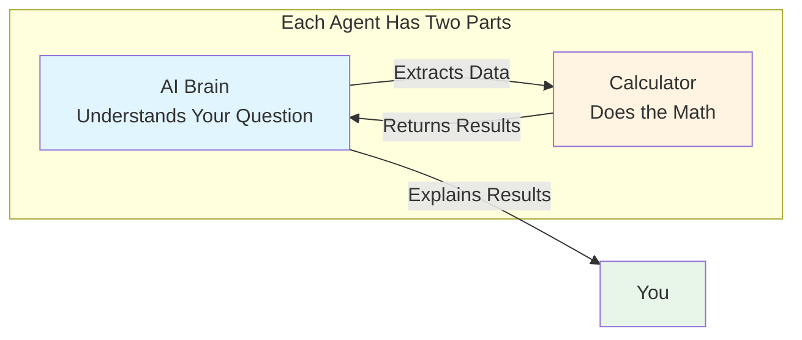
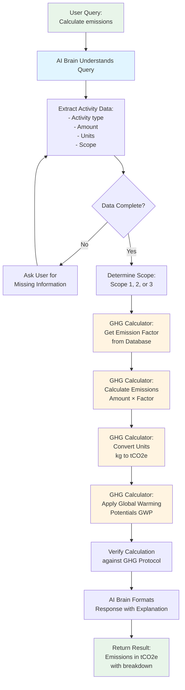
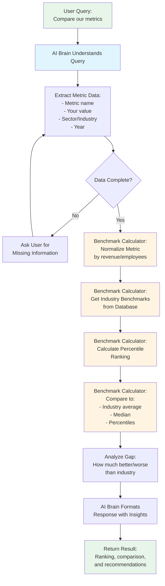
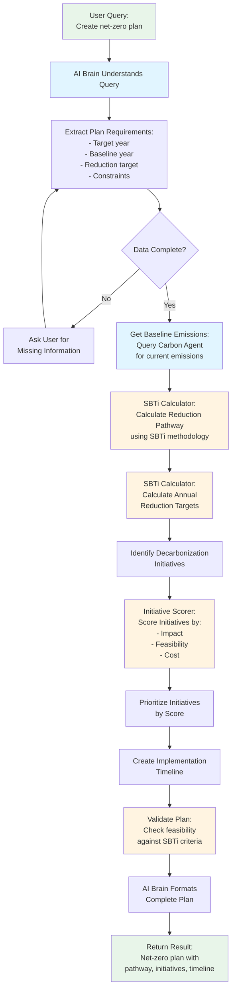
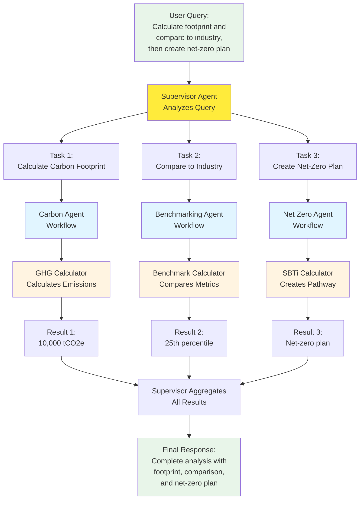

# Agents Architecture & Working Documentation

## Table of Contents
1. [Introduction for ESG Experts](#introduction-for-esg-experts)
2. [Understanding AI Agents](#understanding-ai-agents)
3. [The Three Specialized Agents](#the-three-specialized-agents)
4. [How Agents Work Together](#how-agents-work-together)
5. [ML Concepts Explained](#ml-concepts-explained)
6. [Agent System Architecture](#agent-system-architecture)
7. [Supervisor Agent](#supervisor-agent)
8. [Specialized Agents in Detail](#specialized-agents-in-detail)
9. [Agent Processing Flow](#agent-processing-flow)

---

## Introduction for ESG Experts

### What is an AI Agent?

Think of an AI agent as a **specialized ESG consultant** that never sleeps and has instant access to vast amounts of data. Just like you might have different consultants for different tasks:
- A **carbon accounting specialist** for emissions calculations
- A **benchmarking analyst** for industry comparisons
- A **net-zero strategist** for pathway planning

Our platform has three specialized AI agents, each an expert in their domain, working together to answer your ESG questions.

### Why Three Agents?

Each agent has its own **calculation engine** (calculator) because:

1. **Carbon Accounting Agent** → Uses **GHG Protocol Calculator**
   - Calculates Scope 1, 2, and 3 emissions
   - Applies emission factors from databases
   - Follows GHG Protocol standards

2. **Benchmarking Agent** → Uses **Benchmark Statistics Calculator**
   - Compares your metrics to industry standards
   - Calculates percentiles and rankings
   - Normalizes metrics for fair comparison

3. **Net Zero Agent** → Uses **SBTi Pathway Calculator**
   - Calculates science-based reduction pathways
   - Scores decarbonization initiatives
   - Validates net-zero plans

### The Magic: AI + Calculation Engines

Each agent combines two powerful components:



**The AI Brain** (LLM - Large Language Model):
- Understands your natural language questions
- Extracts relevant data from your query
- Asks clarifying questions if needed
- Explains results in plain language

**The Calculator**:
- Performs accurate mathematical calculations
- Uses verified emission factors and benchmarks
- Follows industry standards (GHG Protocol, SBTi)
- Ensures precision and compliance

---

## Understanding AI Agents

### What Makes an Agent "Intelligent"?

An AI agent in our system is like having a **smart assistant** that:

1. **Understands Context**: Uses RAG (Retrieval Augmented Generation) to find relevant information
2. **Remembers**: Learns from past interactions
3. **Validates**: Checks data before calculations
4. **Clarifies**: Asks questions when information is missing
5. **Calculates**: Uses specialized calculators for accurate results
6. **Explains**: Provides clear, understandable responses

---

## The Three Specialized Agents

### 1. Carbon Accounting Agent

**Purpose**: Calculate and track carbon emissions following GHG Protocol standards.

**What it does**:
- Calculates Scope 1 (direct emissions), Scope 2 (electricity), and Scope 3 (value chain) emissions
- Uses emission factors from verified databases
- Classifies activities into correct scopes
- Generates emission reports

**Calculator**: **GHG Protocol Calculator**
- Contains emission factors for thousands of activities
- Applies Global Warming Potentials (GWP) for CO2, CH4, N2O
- Handles unit conversions automatically
- Validates calculations against GHG Protocol standards

### 2. Benchmarking Agent

**Purpose**: Compare your ESG metrics against industry standards and peers.

**What it does**:
- Compares your metrics to industry averages
- Calculates your percentile ranking
- Identifies gaps and opportunities
- Normalizes metrics for fair comparison

**Calculator**: **Benchmark Statistics Calculator**
- Contains benchmark data for various sectors
- Calculates percentiles (10th, 25th, 50th, 75th, 90th)
- Normalizes metrics by revenue, employees, or other factors
- Compares against peer groups

### 3. Net Zero Agent

**Purpose**: Create and validate science-based net-zero plans.

**What it does**:
- Creates net-zero pathways following SBTi methodology
- Calculates annual reduction targets
- Scores and prioritizes decarbonization initiatives
- Validates plan feasibility

**Calculator**: **SBTi Pathway Calculator**
- Applies Science-Based Targets initiative (SBTi) methodology
- Calculates linear and exponential reduction pathways
- Scores initiatives by impact, feasibility, and cost
- Validates targets against 1.5°C scenarios

---

## Complete Agent Workflows

This section shows the complete workflow for each of the three specialized agents, from receiving a query to delivering the final response.

### Carbon Accounting Agent - Complete Workflow



**Workflow Steps Explained:**

1. **User Query**: User asks in natural language (e.g., "Calculate Scope 1 emissions for 1000L diesel")
2. **AI Understanding**: LLM extracts structured data from the query
3. **Data Extraction**: Identifies activity type, amount, units, and scope
4. **Validation**: Checks if all required data is present
5. **Clarification** (if needed): Asks user for missing information
6. **Scope Determination**: Classifies activity into Scope 1, 2, or 3
7. **Emission Factor Lookup**: GHG Calculator retrieves emission factor from database
8. **Calculation**: Multiplies activity amount by emission factor
9. **Unit Conversion**: Converts to standard units (tCO2e)
10. **GWP Application**: Applies Global Warming Potentials for CH4, N2O
11. **Verification**: Validates calculation against GHG Protocol standards
12. **Response Formatting**: AI formats result with clear explanation
13. **Result**: Returns emissions breakdown with detailed explanation

### Benchmarking Agent - Complete Workflow



**Workflow Steps Explained:**

1. **User Query**: User asks to compare metrics (e.g., "Compare our carbon intensity to industry")
2. **AI Understanding**: LLM extracts metric name, value, sector, and year
3. **Data Extraction**: Identifies what metric to compare and your company's value
4. **Validation**: Checks if all required data is present
5. **Clarification** (if needed): Asks user for missing information
6. **Normalization**: Benchmark Calculator normalizes metric by revenue, employees, or other factors
7. **Benchmark Retrieval**: Gets industry benchmark data from database
8. **Percentile Calculation**: Calculates where you rank (10th, 25th, 50th, 75th, 90th percentile)
9. **Comparison**: Compares your value to industry average, median, and percentiles
10. **Gap Analysis**: Analyzes how much better or worse you are compared to industry
11. **Response Formatting**: AI formats result with insights and recommendations
12. **Result**: Returns ranking, comparison, and actionable insights

### Net Zero Agent - Complete Workflow



**Workflow Steps Explained:**

1. **User Query**: User asks to create a net-zero plan (e.g., "Create net-zero plan for 2050")
2. **AI Understanding**: LLM extracts target year, baseline year, and requirements
3. **Data Extraction**: Identifies plan requirements and constraints
4. **Validation**: Checks if all required data is present
5. **Clarification** (if needed): Asks user for missing information
6. **Get Baseline**: Queries Carbon Agent to get current emissions as baseline
7. **Calculate Pathway**: SBTi Calculator applies SBTi methodology to calculate reduction pathway
8. **Annual Targets**: Calculates annual reduction targets from baseline to zero
9. **Identify Initiatives**: Identifies potential decarbonization initiatives
10. **Score Initiatives**: Scores each initiative by impact, feasibility, and cost
11. **Prioritize**: Ranks initiatives by their scores
12. **Create Timeline**: Creates implementation timeline for prioritized initiatives
13. **Validate Plan**: Validates plan against SBTi criteria and feasibility
14. **Response Formatting**: AI formats complete plan with pathway, initiatives, and timeline
15. **Result**: Returns comprehensive net-zero plan

### Combined Workflow: All Three Agents Working Together



**Combined Workflow Explanation:**

When a user asks a complex question that requires multiple agents:

1. **Supervisor Agent** receives the query and breaks it into tasks
2. **Parallel Execution**: All three agents work simultaneously:
   - **Carbon Agent** calculates emissions using GHG Calculator
   - **Benchmarking Agent** compares metrics using Benchmark Calculator
   - **Net Zero Agent** creates plan using SBTi Calculator (may use Carbon Agent results)
3. **Results Collection**: Each agent returns its results
4. **Aggregation**: Supervisor combines all results into a coherent response
5. **Final Response**: User receives a complete analysis with all information integrated

**Key Points:**
- Each agent has its own specialized calculator
- Agents can work independently or together
- Supervisor coordinates complex multi-agent queries
- Results are combined intelligently for comprehensive answers

---

## How Agents Work Together

### The Supervisor: Your Project Manager

Think of the Supervisor Agent as a **project manager** who:
- Understands your complex questions
- Breaks them into tasks
- Assigns tasks to the right specialist agent
- Combines results into a complete answer

**Example**: "Calculate our carbon footprint and compare it to industry average"

The Supervisor Agent breaks this into two tasks and assigns them to the Carbon Agent and Benchmarking Agent respectively. Results are then combined into a comprehensive answer.

---

## ML Concepts Explained

### What is RAG? (Retrieval Augmented Generation)

**Simple Explanation**: RAG is like having a **research assistant** that:
1. Searches through your knowledge base (documents, reports, standards)
2. Finds relevant information
3. Uses that information to give you accurate answers

**Why it matters for ESG**:
- Your company's historical data
- Industry standards (GHG Protocol, SBTi)
- Emission factor databases
- Benchmark data

### What is a Vector Store?

**Simple Explanation**: A vector store is like a **smart filing cabinet** that:
- Stores documents as "vectors" (mathematical representations)
- Finds similar documents quickly
- Understands meaning, not just keywords

**Example for ESG**:
- You ask: "What are Scope 3 emissions?"
- Vector store finds: Documents about "value chain emissions", "indirect emissions", "supply chain"
- Even if they don't contain the exact words "Scope 3"

### What is an LLM? (Large Language Model)

**Simple Explanation**: An LLM is the **AI brain** that:
- Understands natural language (your questions in plain English)
- Generates human-like responses
- Learns from vast amounts of text
- In our system: Google's Gemini model

**How it helps in ESG**:
- Understands: "Calculate emissions for our diesel usage"
- Extracts: Activity = diesel, Amount = from your data
- Explains: Results in clear, understandable language

### How RAG + LLM + Calculator Work Together

When you ask a question:
1. **RAG System** searches your knowledge base using the vector store to find relevant information
2. **LLM** uses this context to understand your query and extract structured data
3. **Calculator** performs the mathematical calculations using the extracted data
4. **LLM** formats the calculator results into a clear, understandable response

---

## Overview

The Fitsol ESG platform uses a sophisticated multi-agent system where specialized AI agents work together to handle complex ESG queries. Each agent is designed for specific domains (Carbon Accounting, Benchmarking, Net Zero Planning) while sharing common infrastructure for semantic understanding, validation, and learning.

### Key Principles
- **Specialization**: Each agent handles a specific domain with its own calculator
- **Coordination**: Supervisor agent orchestrates multi-agent tasks
- **Intelligence**: Unified semantic understanding with RAG
- **Adaptation**: Continuous learning from user interactions
- **Reliability**: Robust error handling and recovery

---

## Agent System Architecture

The system consists of three specialized agents, each with its own calculator, coordinated by a Supervisor Agent. Each agent follows a similar workflow pattern: understanding the query, extracting data, validating, calculating using its specialized calculator, and formatting the response.

### ML Architecture Box Diagram

```
╔═══════════════════════════════════════════════════════════════════════════════╗
║                    FITSOL ESG ML ARCHITECTURE - BOX DIAGRAM                   ║
╚═══════════════════════════════════════════════════════════════════════════════╝

┌─────────────────────────────────────────────────────────────────────────────┐
│                          LAYER 1: API & ORCHESTRATION                        │
└─────────────────────────────────────────────────────────────────────────────┘

┌──────────────────────────────────┐  ┌──────────────────────────────────┐
│      FastAPI Chat Endpoint       │  │    Query Orchestrator            │
│                                  │  │                                  │
│  • /chat/chat-with-llm/          │  │  • stream_user_query_smart()     │
│  • Authentication                │  │  • Query classification          │
│  • Request validation            │  │  • Route to agents               │
│  • Context preparation           │  │  • Response streaming            │
└──────────────┬───────────────────┘  └──────────────┬───────────────────┘
               │                                      │
               └──────────────────┬───────────────────┘
                                  │
                                  ▼
┌─────────────────────────────────────────────────────────────────────────────┐
│                          LAYER 2: RAG & CONTEXT                             │
└─────────────────────────────────────────────────────────────────────────────┘

┌──────────────────────────────────┐  ┌──────────────────────────────────┐
│      Few-Shot Matcher            │  │    RAG System                    │
│                                  │  │                                  │
│  • Q&A pattern matching          │  │  • Semantic search               │
│  • Instant answer lookup         │  │  • Vector store query            │
│  • Bypass LLM for known queries  │  │  • Context retrieval             │
│  • Score-based matching          │  │  • Document ranking              │
└──────────────────────────────────┘  └──────────────┬───────────────────┘
                                                    │
┌──────────────────────────────────┐  ┌─────────────┴───────────────────┐
│      Vector Store                │  │    Knowledge Base Manager       │
│                                  │  │                                 │
│  • FAISS vector database         │  │  • System KB management         │
│  • Document embeddings           │  │  • User KB management           │
│  • Similarity search             │  │  • File path resolution         │
│  • Top-K retrieval               │  │  • Embedding generation         │
└──────────────────────────────────┘  └─────────────────────────────────┘

┌─────────────────────────────────────────────────────────────────────────────┐
│                          LAYER 3: SUPERVISOR AGENT                          │
└─────────────────────────────────────────────────────────────────────────────┘

┌─────────────────────────────────────────────────────────────────────────────┐
│                         SUPERVISOR AGENT                                    │
│                                                                             │
│  ┌──────────────────────┐  ┌──────────────────────┐  ┌──────────────────┐   │
│  │   Task Planner       │  │  Execution           │  │  Result          │   │
│  │                      │  │  Coordinator         │  │  Aggregator      │   │
│  │  • Query analysis    │  │  • Parallel exec     │  │  • Merge results │   │
│  │  • Task breakdown    │  │  • Sequential exec   │  │  • Format output │   │
│  │  • Dependency graph  │  │  • Agent routing     │  │  • Resolve confl │   │
│  │  • Execution plan    │  │  • Error handling    │  │  • Final response│   │
│  └──────────────────────┘  └──────────────────────┘  └──────────────────┘   │
│                                                                             │
│  ┌──────────────────────────────────────────────────────────────────────┐   │
│  │                    Agent Registry                                    │   │
│  │  • Carbon Agent      • Benchmarking Agent    • Net Zero Agent        │   │
│  │  • Capability lookup • Health monitoring      • Status tracking      │   │
│  └──────────────────────────────────────────────────────────────────────┘   │
└──────────────────────┬──────────────────────────────────────────────────────┘
                       │
        ┌──────────────┼──────────────┐
        │              │              │
        ▼              ▼              ▼
┌─────────────────────────────────────────────────────────────────────────────┐
│                     LAYER 4: SPECIALIZED AGENTS                             │
└─────────────────────────────────────────────────────────────────────────────┘

┌─────────────────────────────────────────────────────────────────────────────┐
│                    CARBON ACCOUNTING AGENT                                  │
├─────────────────────────────────────────────────────────────────────────────┤
│                                                                             │
│  ┌──────────────────────┐  ┌──────────────────────┐  ┌──────────────────┐   │
│  │  Extraction Handler  │  │  Calculation         │  │  Response        │   │
│  │                      │  │  Orchestrator        │  │  Formatter       │   │
│  │  • Activity extract  │  │  • GHG Calculator    │  │  • Format result │   │
│  │  • Unit normalization│  │  • Scope classif     │  │  • Add explain   │   │
│  │  • Scope detection   │  │  • Emission calc     │  │  • Citations     │   │
│  └──────────────────────┘  └──────────────────────┘  └──────────────────┘   │
│                                                                             │
│  ┌──────────────────────────────────────────────────────────────────────┐   │
│  │                   GHG PROTOCOL CALCULATOR                            │   │
│  │  • Emission factor DB    • Unit conversion      • GWP application    │   │
│  │  • Scope classification  • Calculation engine   • Validation         │   │
│  └──────────────────────────────────────────────────────────────────────┘   │
│                                                                             │
│  Inherits: BaseUnifiedSemanticEngine | BaseSemanticValidator |              │
│            BaseClarificationGenerator                                       │
│  Implements: ActivityTypeRegistry | Carbon-specific validation rules        │
└─────────────────────────────────────────────────────────────────────────────┘

┌─────────────────────────────────────────────────────────────────────────────┐
│                    BENCHMARKING AGENT                                       │
├─────────────────────────────────────────────────────────────────────────────┤
│                                                                             │
│  ┌──────────────────────┐  ┌──────────────────────┐  ┌──────────────────┐   │
│  │  Metric Extractor    │  │  Calculation Handler │  │  Response        │   │
│  │                      │  │                      │  │  Formatter       │   │
│  │  • Metric identify   │  │  • Benchmark Calc    │  │  • Format result │   │
│  │  • Value extract     │  │  • Normalization     │  │  • Add insights  │   │
│  │  • Sector detect     │  │  • Percentile calc   │  │  • Recommendations│  │
│  └──────────────────────┘  └──────────────────────┘  └──────────────────┘   │
│                                                                             │
│  ┌──────────────────────────────────────────────────────────────────────┐   │
│  │              BENCHMARK STATISTICS CALCULATOR                         │   │
│  │  • Benchmark DB         • Percentile calculation  • Normalization    │   │
│  │  • Sector data          • Ranking algorithm       • Comparison       │   │
│  └──────────────────────────────────────────────────────────────────────┘   │
│                                                                             │
│  Inherits: BaseUnifiedSemanticEngine | BaseSemanticValidator |              │
│            BaseClarificationGenerator                                       │
│  Implements: MetricTypeRegistry | Sector-specific validation rules          │
└─────────────────────────────────────────────────────────────────────────────┘

┌─────────────────────────────────────────────────────────────────────────────┐
│                    NET ZERO PLANNING AGENT                                  │
├─────────────────────────────────────────────────────────────────────────────┤
│                                                                             │
│  ┌──────────────────────┐  ┌──────────────────────┐  ┌──────────────────┐   │
│  │  Plan Extractor      │  │  Pathway Generator   │  │  Initiative      │   │
│  │                      │  │                      │  │  Scorer          │   │
│  │  • Goal extract      │  │  • SBTi Calculator   │  │  • Impact score  │   │
│  │  • Target extract    │  │  • Annual targets    │  │  • Feasibility   │   │
│  │  • Constraint detect │  │  • Timeline gen      │  │  • Cost analysis │   │
│  └──────────────────────┘  └──────────────────────┘  └──────────────────┘   │
│                                                                             │
│  ┌──────────────────────────────────────────────────────────────────────┐   │
│  │                    SBTi PATHWAY CALCULATOR                           │   │
│  │  • SBTi methodology   • Reduction pathways  • Target validation      │   │
│  │  • Linear/exponential • Annual calculations  • Feasibility check     │   │
│  └──────────────────────────────────────────────────────────────────────┘   │
│                                                                             │
│  Inherits: BaseUnifiedSemanticEngine | BaseSemanticValidator |              │
│            BaseClarificationGenerator                                       │
│  Implements: ScenarioTypeRegistry | Pathway-specific validation rules       │
└─────────────────────────────────────────────────────────────────────────────┘

┌─────────────────────────────────────────────────────────────────────────────┐
│                     LAYER 5: SHARED INFRASTRUCTURE                          │
└─────────────────────────────────────────────────────────────────────────────┘

┌─────────────────────────────────────────────────────────────────────────────┐
│                    ABSTRACT BASE CLASSES (Inheritance)                      │
├─────────────────────────────────────────────────────────────────────────────┤
│                                                                             │
│  ┌──────────────────────┐  ┌──────────────────────┐  ┌──────────────────┐   │
│  │ BaseUnifiedSemantic  │  │ BaseSemantic         │  │ BaseClarification│   │
│  │ Engine               │  │ Validator            │  │ Generator        │   │
│  │                      │  │                      │  │                  │   │
│  │ • LLM integration    │  │ • Validation         │  │ • Gap analysis   │   │
│  │ • Query understanding│  │   framework          │  │ • Question       │   │
│  │ • Entity extraction  │  │ • Alignment checks   │  │   generation     │   │
│  │ • Intent classification│  │ • Consistency rules │  │ • Context       │   │
│  │ • Extensible interface│  │ • Relevance checks  │  │   formatting     │   │
│  └──────────────────────┘  └──────────────────────┘  └──────────────────┘   │
│                                                                             │
│  All agents inherit from these base classes and implement domain-specific   │
│  logic (ActivityTypeRegistry, MetricTypeRegistry, ScenarioTypeRegistry)     │
└─────────────────────────────────────────────────────────────────────────────┘

┌─────────────────────────────────────────────────────────────────────────────┐
│                    INTER-AGENT COMMUNICATION SYSTEM                         │
├─────────────────────────────────────────────────────────────────────────────┤
│                                                                             │
│  ┌──────────────────────┐  ┌──────────────────────┐  ┌──────────────────┐   │
│  │   Message Queue      │  │   Shared State       │  │   Event Bus      │   │
│  │                      │  │                      │  │                  │   │
│  │ • Asynchronous       │  │ • TTL-based cache    │  │ • Publish/       │   │
│  │   messaging          │  │ • Context sharing    │  │   Subscribe      │   │
│  │ • Request/Response   │  │ • Result caching     │  │ • Event-driven   │   │
│  │ • Direct agent comm  │  │ • Session state      │  │   coordination   │   │
│  └──────────────────────┘  └──────────────────────┘  └──────────────────┘   │
│                                                                             │
│  ┌──────────────────────────────────────────────────────────────────────┐   │
│  │                    Learning Store                                    │   │
│  │  • Pattern storage    • Outcome tracking  • Performance metrics      │   │
│  └──────────────────────────────────────────────────────────────────────┘   │
│                                                                             │
│  SharedMemory API: request_data() | respond_to_request() | send_message()   │
└─────────────────────────────────────────────────────────────────────────────┘

┌──────────────────────────────────┐  ┌──────────────────────────────────┐
│   Learning Engine                │  │   Error Handler                  │
│                                  │  │                                  │
│  • Pattern analysis              │  │  • Error classification          │
│  • Performance tracking          │  │  • Retry logic                   │
│  • Model improvement             │  │  • Recovery strategies           │
│  • Feedback integration          │  │  • Fallback mechanisms           │
│  • Configuration updates         │  │  • Error logging                 │
└──────────────────────────────────┘  └──────────────────────────────────┘

┌─────────────────────────────────────────────────────────────────────────────┐
│                     LAYER 6: LLM & EXTERNAL SERVICES                        │
└─────────────────────────────────────────────────────────────────────────────┘

┌──────────────────────────────────┐  ┌──────────────────────────────────┐
│   Google Gemini LLM              │  │   LLM Client Manager             │
│                                  │  │                                  │
│  • Gemini 2.0 Flash              │  │  • Multi-provider support        │
│  • Natural language processing   │  │  • API key management            │
│  • Response generation           │  │  • Rate limiting                 │
│  • Tool calling                  │  │  • Error handling                │
│  • Streaming support             │  │  • Token tracking                │
└──────────────────────────────────┘  └──────────────────────────────────┘

┌─────────────────────────────────────────────────────────────────────────────┐
│                     LAYER 7: DATA STORAGE                                   │
└─────────────────────────────────────────────────────────────────────────────┘

┌──────────────────────────────────┐  ┌──────────────────────────────────┐
│   MongoDB                        │  │   SQLite                         │
│                                  │  │                                  │
│  • Chat history                  │  │  • Emission factors              │
│  • User data                     │  │  • Benchmark data                │
│  • Knowledge sources             │  │  • Conversion factors            │
│  • Message storage               │  │  • Scope classifications         │
│  • File metadata                 │  │  • Reference data                │
└──────────────────────────────────┘  └──────────────────────────────────┘

┌──────────────────────────────────┐  ┌──────────────────────────────────┐
│   Vector Store (FAISS)           │  │   File Storage                   │
│                                  │  │                                  │
│  • Document embeddings           │  │  • Uploaded files                │
│  • Semantic search index         │  │  • Processed documents           │
│  • Similarity calculations       │  │  • Knowledge base files          │
│  • Top-K retrieval               │  │  • Temporary files               │
└──────────────────────────────────┘  └──────────────────────────────────┘

┌─────────────────────────────────────────────────────────────────────────────┐
│                     DATA FLOW CONNECTIONS                                    │
└─────────────────────────────────────────────────────────────────────────────┘

    API Endpoint
         │
         ├─→ Query Orchestrator
         │        │
         │        ├─→ Few-Shot Matcher ──→ [Instant Response]
         │        │
         │        └─→ RAG System
         │                 │
         │                 ├─→ Vector Store ──→ Context
         │                 │
         │                 └─→ Knowledge Base ──→ Documents
         │
         └─→ Supervisor Agent
                  │
                  ├─→ Task Planner ──→ Execution Plan
                  │
                  ├─→ Execution Coordinator
                  │        │
                  │        ├─→ Carbon Agent ──→ GHG Calculator ──→ Result
                  │        │
                  │        ├─→ Benchmarking Agent ──→ Benchmark Calc ──→ Result
                  │        │
                  │        └─→ Net Zero Agent ──→ SBTi Calculator ──→ Result
                  │
                  └─→ Result Aggregator ──→ Final Response ──→ Stream to User

┌─────────────────────────────────────────────────────────────────────────────┐
│                     ARCHITECTURE PATTERNS                                    │
└─────────────────────────────────────────────────────────────────────────────┘

Inheritance Hierarchy:
    BaseUnifiedSemanticEngine (Abstract)
        ├─→ CarbonAgent.UnifiedSemanticEngine
        ├─→ BenchmarkingAgent.UnifiedSemanticEngine
        └─→ NetZeroAgent.UnifiedSemanticEngine
    
    BaseSemanticValidator (Abstract)
        ├─→ CarbonAgent.SemanticValidator (ActivityTypeRegistry)
        ├─→ BenchmarkingAgent.SemanticValidator (MetricTypeRegistry)
        └─→ NetZeroAgent.SemanticValidator (ScenarioTypeRegistry)
    
    BaseClarificationGenerator (Abstract)
        ├─→ CarbonAgent.IntelligentClarificationGenerator
        ├─→ BenchmarkingAgent.IntelligentClarificationGenerator
        └─→ NetZeroAgent.IntelligentClarificationGenerator

Agent-Specific Components (No Inheritance):
    ├─→ Domain Calculators (GHG, Benchmark, SBTi)
    ├─→ Extraction Handlers (Activity, Metric, Plan)
    ├─→ Response Formatters (Domain-specific formatting)
    └─→ Workflow Orchestrators (Agent-specific workflows)

Inter-Agent Communication (SharedMemory):
    ├─→ Message Queue: Asynchronous request/response messaging
    ├─→ Shared State: TTL-based context and result caching
    ├─→ Event Bus: Publish/subscribe for coordination
    ├─→ Learning Store: Shared pattern and outcome storage
    └─→ API Methods: request_data() | respond_to_request() | send_message()

┌─────────────────────────────────────────────────────────────────────────────┐
│                     KEY FEATURES                                            │
└─────────────────────────────────────────────────────────────────────────────┘

✓ Multi-Agent System with Supervisor Coordination
✓ RAG (Retrieval Augmented Generation) for Context
✓ Few-Shot Learning for Instant Answers
✓ Specialized Calculators per Domain
✓ Intelligent Clarification System
✓ Streaming Responses for Real-time UX
✓ Error Handling & Recovery
✓ Continuous Learning & Improvement
✓ Multi-provider LLM Support
✓ Vector-based Semantic Search
```

**Architecture Design Principles:**

**1. Inheritance-Based Modularity:**
- Abstract base classes define contracts in `ml/agents/common/`
- Agents implement domain-specific logic through inheritance
- Reduces code duplication while enabling specialization
- Follows Open/Closed Principle (open for extension, closed for modification)

**2. Inter-Agent Communication:**
- **Message Queue**: Asynchronous request/response pattern for data exchange
- **Shared State**: TTL-based caching for context and intermediate results
- **Event Bus**: Publish/subscribe pattern for coordination and notifications
- **Learning Store**: Centralized pattern storage for continuous improvement

**3. Supervisor Coordination:**
- Task decomposition and dependency resolution
- Parallel and sequential execution orchestration
- Result aggregation and conflict resolution
- Health monitoring and failover handling

**4. Domain Specialization:**
- Each agent implements domain-specific type registries
- Calculators are agent-specific (no inheritance)
- Extraction handlers tailored to domain entities
- Response formatters customized for domain context

### ML Architecture Swimlane Diagram

```mermaid
graph TB
    subgraph API_LANE["🔷 API & ORCHESTRATION LANE"]
        API[FastAPI Chat Endpoint<br/>/chat/chat-with-llm/]
        AUTH[Authentication<br/>Token Validation]
        REQ_VAL[Request Validation<br/>Input Sanitization]
        CONTEXT_PREP[Context Preparation<br/>Session Management]
        ORCH[Query Orchestrator<br/>stream_user_query_smart]
        API --> AUTH
        AUTH --> REQ_VAL
        REQ_VAL --> CONTEXT_PREP
        CONTEXT_PREP --> ORCH
    end
    
    subgraph RAG_LANE["🔷 RAG & CONTEXT LANE"]
        FEWSHOT[Few-Shot Matcher<br/>Q&A Pattern Matching]
        INSTANT_ANS[Instant Answer Lookup<br/>Bypass LLM for Known Queries]
        RAG[RAG System<br/>Semantic Search]
        SEM_SEARCH[Semantic Search Engine<br/>Context Retrieval]
        DOC_RANK[Document Ranking<br/>Relevance Scoring]
        VECTOR[Vector Store<br/>FAISS Database]
        EMBED[Document Embeddings<br/>Vector Generation]
        SIM_SEARCH[Similarity Search<br/>Top-K Retrieval]
        KB[Knowledge Base Manager<br/>System & User KB]
        KB_MGMT[KB Management<br/>File Path Resolution]
        EMBED_GEN[Embedding Generation<br/>Text Processing]
        ORCH --> FEWSHOT
        FEWSHOT --> INSTANT_ANS
        ORCH --> RAG
        RAG --> SEM_SEARCH
        SEM_SEARCH --> DOC_RANK
        RAG --> VECTOR
        VECTOR --> EMBED
        VECTOR --> SIM_SEARCH
        RAG --> KB
        KB --> KB_MGMT
        KB --> EMBED_GEN
    end
    
    subgraph SUPERVISOR_LANE["🔷 SUPERVISOR AGENT LANE"]
        TASK[Task Planner<br/>Query Analysis & Breakdown]
        QUERY_ANALYSIS[Query Analysis<br/>Intent Understanding]
        TASK_BREAKDOWN[Task Breakdown<br/>Dependency Resolution]
        DEP_GRAPH[Dependency Graph<br/>Execution Planning]
        EXEC[Execution Coordinator<br/>Parallel/Sequential Exec]
        PARALLEL[Parallel Execution<br/>Concurrent Tasks]
        SEQUENTIAL[Sequential Execution<br/>Dependent Tasks]
        AGENT_ROUTING[Agent Routing<br/>Task Assignment]
        ERROR_HANDLING_SUP[Error Handling<br/>Recovery & Retry]
        REGISTRY[Agent Registry<br/>Capability Lookup]
        CAP_LOOKUP[Capability Lookup<br/>Agent Selection]
        HEALTH_MON[Health Monitoring<br/>Status Tracking]
        AGG[Result Aggregator<br/>Merge & Format Results]
        MERGE_RESULTS[Merge Results<br/>Conflict Resolution]
        FORMAT_OUTPUT[Format Output<br/>Response Generation]
        RAG --> TASK
        TASK --> QUERY_ANALYSIS
        QUERY_ANALYSIS --> TASK_BREAKDOWN
        TASK_BREAKDOWN --> DEP_GRAPH
        DEP_GRAPH --> EXEC
        EXEC --> PARALLEL
        EXEC --> SEQUENTIAL
        EXEC --> AGENT_ROUTING
        EXEC --> ERROR_HANDLING_SUP
        EXEC --> REGISTRY
        REGISTRY --> CAP_LOOKUP
        REGISTRY --> HEALTH_MON
        EXEC --> AGG
        AGG --> MERGE_RESULTS
        MERGE_RESULTS --> FORMAT_OUTPUT
    end
    
    subgraph CARBON_LANE["🔷 CARBON ACCOUNTING AGENT LANE"]
        C_EXT[Extraction Handler<br/>Activity Extraction]
        ACTIVITY_EXT[Activity Extraction<br/>Entity Identification]
        UNIT_NORM[Unit Normalization<br/>Conversion Handling]
        SCOPE_DETECT[Scope Detection<br/>Classification]
        C_CALC[Calculation Orchestrator<br/>GHG Calculator]
        SCOPE_CLASS[Scope Classification<br/>1, 2, 3 Assignment]
        EMISSION_CALC[Emission Calculation<br/>Factor Application]
        C_RESP[Response Formatter<br/>Format & Explain]
        FORMAT_RESULT[Format Result<br/>Structured Output]
        ADD_EXPLAIN[Add Explanation<br/>Context & Citations]
        GHG[GHG Protocol Calculator<br/>Emission Factors & GWP]
        EF_DB[Emission Factor DB<br/>Verified Sources]
        UNIT_CONV[Unit Conversion<br/>Standardization]
        GWP_APPLY[GWP Application<br/>CO2e Calculation]
        VALIDATION_C[Validation<br/>GHG Protocol Compliance]
        REGISTRY -->|Route| C_EXT
        C_EXT --> ACTIVITY_EXT
        C_EXT --> UNIT_NORM
        C_EXT --> SCOPE_DETECT
        C_EXT --> C_CALC
        C_CALC --> SCOPE_CLASS
        C_CALC --> EMISSION_CALC
        C_CALC --> GHG
        GHG --> EF_DB
        GHG --> UNIT_CONV
        GHG --> GWP_APPLY
        GHG --> VALIDATION_C
        GHG --> C_RESP
        C_RESP --> FORMAT_RESULT
        C_RESP --> ADD_EXPLAIN
        C_RESP --> AGG
        C_EXT -.->|Uses| BASE_SEMANTIC
        C_EXT -.->|Uses| BASE_VALIDATOR
        C_EXT -.->|Uses| BASE_CLARIFY
    end
    
    subgraph BENCH_LANE["🔷 BENCHMARKING AGENT LANE"]
        B_EXT[Metric Extractor<br/>Metric Identification]
        METRIC_ID[Metric Identification<br/>Type Classification]
        VALUE_EXT[Value Extraction<br/>Data Parsing]
        SECTOR_DETECT[Sector Detection<br/>Industry Classification]
        B_CALC[Calculation Handler<br/>Benchmark Calculator]
        NORMALIZE[Normalization<br/>Revenue/Employee Scaling]
        PERCENTILE[Percentile Calculation<br/>Ranking Algorithm]
        B_RESP[Response Formatter<br/>Insights & Recommendations]
        FORMAT_BENCH[Format Result<br/>Comparison Tables]
        ADD_INSIGHTS[Add Insights<br/>Gap Analysis]
        RECOMMEND[Recommendations<br/>Actionable Insights]
        BENCH_CALC[Benchmark Statistics Calculator<br/>Percentiles & Rankings]
        BENCH_DB[Benchmark Database<br/>Industry Data]
        SECTOR_DATA[Sector Data<br/>Peer Comparison]
        RANKING[Ranking Algorithm<br/>Percentile Calculation]
        COMPARE[Comparison Engine<br/>Relative Performance]
        REGISTRY -->|Route| B_EXT
        B_EXT --> METRIC_ID
        B_EXT --> VALUE_EXT
        B_EXT --> SECTOR_DETECT
        B_EXT --> B_CALC
        B_CALC --> NORMALIZE
        B_CALC --> PERCENTILE
        B_CALC --> BENCH_CALC
        BENCH_CALC --> BENCH_DB
        BENCH_CALC --> SECTOR_DATA
        BENCH_CALC --> RANKING
        BENCH_CALC --> COMPARE
        BENCH_CALC --> B_RESP
        B_RESP --> FORMAT_BENCH
        B_RESP --> ADD_INSIGHTS
        B_RESP --> RECOMMEND
        B_RESP --> AGG
        B_EXT -.->|Uses| BASE_SEMANTIC
        B_EXT -.->|Uses| BASE_VALIDATOR
        B_EXT -.->|Uses| BASE_CLARIFY
    end
    
    subgraph NETZERO_LANE["🔷 NET ZERO PLANNING AGENT LANE"]
        N_EXT[Plan Extractor<br/>Goal & Target Extraction]
        GOAL_EXT[Goal Extraction<br/>Net Zero Objectives]
        TARGET_EXT[Target Extraction<br/>Reduction Goals]
        CONSTRAINT_DETECT[Constraint Detection<br/>Limitations & Requirements]
        N_PATH[Pathway Generator<br/>SBTi Calculator]
        ANNUAL_TARGETS[Annual Targets<br/>Yearly Milestones]
        TIMELINE_GEN[Timeline Generation<br/>Implementation Schedule]
        N_SCORE[Initiative Scorer<br/>Impact & Feasibility]
        IMPACT_SCORE[Impact Score<br/>Emission Reduction]
        FEASIBILITY[Feasibility Analysis<br/>Implementation Viability]
        COST_ANALYSIS[Cost Analysis<br/>ROI Calculation]
        N_RESP[Response Formatter<br/>Complete Plan]
        FORMAT_PLAN[Format Plan<br/>Structured Pathway]
        ADD_TIMELINE[Add Timeline<br/>Implementation Roadmap]
        SBTI[SBTi Pathway Calculator<br/>Reduction Pathways]
        SBTI_METHOD[SBTi Methodology<br/>Science-Based Approach]
        REDUCTION_PATH[Reduction Pathways<br/>Linear/Exponential]
        TARGET_VALID[Target Validation<br/>SBTi Compliance]
        FEASIBILITY_CHECK[Feasibility Check<br/>Plan Viability]
        REGISTRY -->|Route| N_EXT
        N_EXT --> GOAL_EXT
        N_EXT --> TARGET_EXT
        N_EXT --> CONSTRAINT_DETECT
        N_EXT --> N_PATH
        N_PATH --> ANNUAL_TARGETS
        N_PATH --> TIMELINE_GEN
        N_PATH --> SBTI
        SBTI --> SBTI_METHOD
        SBTI --> REDUCTION_PATH
        SBTI --> TARGET_VALID
        SBTI --> FEASIBILITY_CHECK
        SBTI --> N_SCORE
        N_SCORE --> IMPACT_SCORE
        N_SCORE --> FEASIBILITY
        N_SCORE --> COST_ANALYSIS
        N_SCORE --> N_RESP
        N_RESP --> FORMAT_PLAN
        N_RESP --> ADD_TIMELINE
        N_RESP --> AGG
        N_EXT -.->|Uses| BASE_SEMANTIC
        N_EXT -.->|Uses| BASE_VALIDATOR
        N_EXT -.->|Uses| BASE_CLARIFY
    end
    
    subgraph SHARED_LANE["🔷 SHARED INFRASTRUCTURE LANE"]
        BASE_SEMANTIC[BaseUnifiedSemanticEngine<br/>Abstract Base Class]
        LLM_INTEGRATION[LLM Integration<br/>Gemini Client]
        QUERY_UNDERSTAND[Query Understanding<br/>Intent Classification]
        ENTITY_EXT[Entity Extraction<br/>Data Parsing]
        INTENT_CLASS[Intent Classification<br/>Task Routing]
        BASE_VALIDATOR[BaseSemanticValidator<br/>Abstract Base Class]
        VALID_FRAMEWORK[Validation Framework<br/>Rule Engine]
        ALIGNMENT_CHECKS[Alignment Checks<br/>Data Consistency]
        CONSISTENCY[Consistency Rules<br/>Validation Logic]
        RELEVANCE[Relevance Checks<br/>Data Quality]
        BASE_CLARIFY[BaseClarificationGenerator<br/>Abstract Base Class]
        GAP_ANALYSIS[Gap Analysis<br/>Missing Data Detection]
        QUESTION_GEN[Question Generation<br/>Dynamic Clarification]
        CONTEXT_HANDLING[Context Handling<br/>User Preferences]
        SHARED_MEM[SharedMemory System<br/>Inter-Agent Communication]
        MSG_QUEUE[Message Queue<br/>Async Request/Response]
        ASYNC_MSG[Asynchronous Messaging<br/>Non-blocking Communication]
        REQ_RESP[Request/Response<br/>Agent Data Exchange]
        DIRECT_MSG[Direct Messaging<br/>Agent-to-Agent]
        SHARED_STATE[Shared State<br/>TTL-based Cache]
        TTL_CACHE[TTL-based Cache<br/>Automatic Expiration]
        CONTEXT_SHARE[Context Sharing<br/>Session State]
        RESULT_CACHE[Result Caching<br/>Intermediate Storage]
        SESSION_STATE[Session State<br/>User Context]
        EVENT_BUS[Event Bus<br/>Publish/Subscribe]
        PUB_SUB[Publish/Subscribe<br/>Event Coordination]
        EVENT_DRIVEN[Event-driven<br/>Reactive Architecture]
        COORDINATION[Coordination<br/>Multi-Agent Sync]
        LEARN_STORE[Learning Store<br/>Pattern Storage]
        PATTERN_STORAGE[Pattern Storage<br/>Query Patterns]
        OUTCOME_TRACK[Outcome Tracking<br/>Success Metrics]
        PERF_METRICS[Performance Metrics<br/>Quality Indicators]
        LEARN[Learning Engine<br/>Pattern Analysis]
        PATTERN_ANALYSIS[Pattern Analysis<br/>Query Classification]
        PERF_TRACK[Performance Tracking<br/>Quality Monitoring]
        MODEL_IMPROVE[Model Improvement<br/>Continuous Learning]
        FEEDBACK_INT[Feedback Integration<br/>User Corrections]
        CONFIG_UPDATE[Configuration Updates<br/>Parameter Tuning]
        ERROR_HANDLER[Error Handler<br/>Recovery Strategies]
        ERROR_CLASS[Error Classification<br/>Type Detection]
        RETRY_LOGIC[Retry Logic<br/>Automatic Recovery]
        RECOVERY[Recovery Strategies<br/>Fallback Mechanisms]
        FALLBACK[Fallback Mechanisms<br/>Alternative Paths]
        ERROR_LOG[Error Logging<br/>Diagnostic Data]
        BASE_SEMANTIC --> LLM_INTEGRATION
        BASE_SEMANTIC --> QUERY_UNDERSTAND
        BASE_SEMANTIC --> ENTITY_EXT
        BASE_SEMANTIC --> INTENT_CLASS
        BASE_VALIDATOR --> VALID_FRAMEWORK
        BASE_VALIDATOR --> ALIGNMENT_CHECKS
        BASE_VALIDATOR --> CONSISTENCY
        BASE_VALIDATOR --> RELEVANCE
        BASE_CLARIFY --> GAP_ANALYSIS
        BASE_CLARIFY --> QUESTION_GEN
        BASE_CLARIFY --> CONTEXT_HANDLING
        SHARED_MEM --> MSG_QUEUE
        MSG_QUEUE --> ASYNC_MSG
        MSG_QUEUE --> REQ_RESP
        MSG_QUEUE --> DIRECT_MSG
        SHARED_MEM --> SHARED_STATE
        SHARED_STATE --> TTL_CACHE
        SHARED_STATE --> CONTEXT_SHARE
        SHARED_STATE --> RESULT_CACHE
        SHARED_STATE --> SESSION_STATE
        SHARED_MEM --> EVENT_BUS
        EVENT_BUS --> PUB_SUB
        EVENT_BUS --> EVENT_DRIVEN
        EVENT_BUS --> COORDINATION
        SHARED_MEM --> LEARN_STORE
        LEARN_STORE --> PATTERN_STORAGE
        LEARN_STORE --> OUTCOME_TRACK
        LEARN_STORE --> PERF_METRICS
        LEARN --> PATTERN_ANALYSIS
        LEARN --> PERF_TRACK
        LEARN --> MODEL_IMPROVE
        LEARN --> FEEDBACK_INT
        LEARN --> CONFIG_UPDATE
        ERROR_HANDLER --> ERROR_CLASS
        ERROR_HANDLER --> RETRY_LOGIC
        ERROR_HANDLER --> RECOVERY
        ERROR_HANDLER --> FALLBACK
        ERROR_HANDLER --> ERROR_LOG
        C_EXT -->|Communicate| SHARED_MEM
        B_EXT -->|Communicate| SHARED_MEM
        N_EXT -->|Communicate| SHARED_MEM
    end
    
    subgraph LLM_LANE["🔷 LLM & EXTERNAL SERVICES LANE"]
        GEMINI[Google Gemini LLM<br/>Gemini 2.0 Flash]
        NLP[Natural Language Processing<br/>Query Understanding]
        RESPONSE_GEN[Response Generation<br/>Text Synthesis]
        TOOL_CALLING[Tool Calling<br/>Function Execution]
        STREAMING[Streaming Support<br/>Real-time Responses]
        LLM_MGR[LLM Client Manager<br/>API Key & Rate Limiting]
        MULTI_PROVIDER[Multi-provider Support<br/>Provider Abstraction]
        API_KEY_MGMT[API Key Management<br/>Secure Storage]
        RATE_LIMIT[Rate Limiting<br/>Request Throttling]
        ERROR_HANDLE_LLM[Error Handling<br/>API Failures]
        TOKEN_TRACK[Token Tracking<br/>Usage Monitoring]
        BASE_SEMANTIC --> GEMINI
        RAG --> GEMINI
        GEMINI --> NLP
        GEMINI --> RESPONSE_GEN
        GEMINI --> TOOL_CALLING
        GEMINI --> STREAMING
        GEMINI --> LLM_MGR
        LLM_MGR --> MULTI_PROVIDER
        LLM_MGR --> API_KEY_MGMT
        LLM_MGR --> RATE_LIMIT
        LLM_MGR --> ERROR_HANDLE_LLM
        LLM_MGR --> TOKEN_TRACK
    end
    
    subgraph DATA_LANE["🔷 DATA STORAGE LANE"]
        MONGO[(MongoDB<br/>Chat History & User Data)]
        CHAT_HIST[Chat History<br/>Conversation Storage]
        USER_DATA[User Data<br/>Profile & Preferences]
        KNOWLEDGE_SRC[Knowledge Sources<br/>Document Metadata]
        MSG_STORAGE[Message Storage<br/>Query & Response]
        FILE_META[File Metadata<br/>Upload Tracking]
        SQLITE[(SQLite<br/>Emission Factors & Benchmarks)]
        EMISSION_FACTORS[Emission Factors<br/>GHG Protocol Data]
        BENCHMARK_DATA[Benchmark Data<br/>Industry Statistics]
        CONV_FACTORS[Conversion Factors<br/>Unit Conversions]
        SCOPE_CLASS_DB[Scope Classifications<br/>Activity Mapping]
        REF_DATA[Reference Data<br/>Standards & Guidelines]
        FAISS_STORE[(FAISS Vector Store<br/>Document Embeddings)]
        DOC_EMBED[Document Embeddings<br/>Vector Representations]
        SEM_INDEX[Semantic Search Index<br/>Similarity Search]
        SIM_CALC[Similarity Calculations<br/>Cosine Distance]
        TOP_K[Top-K Retrieval<br/>Relevant Documents]
        FILE_STORE[File Storage<br/>Uploaded & Processed Files]
        UPLOADED[Uploaded Files<br/>User Documents]
        PROCESSED[Processed Documents<br/>Parsed Content]
        KB_FILES[Knowledge Base Files<br/>System Documents]
        TEMP_FILES[Temporary Files<br/>Processing Cache]
        GHG --> SQLITE
        BENCH_CALC --> SQLITE
        SBTI --> SQLITE
        SQLITE --> EMISSION_FACTORS
        SQLITE --> BENCHMARK_DATA
        SQLITE --> CONV_FACTORS
        SQLITE --> SCOPE_CLASS_DB
        SQLITE --> REF_DATA
        C_RESP --> MONGO
        B_RESP --> MONGO
        N_RESP --> MONGO
        MONGO --> CHAT_HIST
        MONGO --> USER_DATA
        MONGO --> KNOWLEDGE_SRC
        MONGO --> MSG_STORAGE
        MONGO --> FILE_META
        VECTOR --> FAISS_STORE
        FAISS_STORE --> DOC_EMBED
        FAISS_STORE --> SEM_INDEX
        FAISS_STORE --> SIM_CALC
        FAISS_STORE --> TOP_K
        KB --> FILE_STORE
        FILE_STORE --> UPLOADED
        FILE_STORE --> PROCESSED
        FILE_STORE --> KB_FILES
        FILE_STORE --> TEMP_FILES
    end
    
    FEWSHOT -->|Instant Answer| USER[👤 User Response]
    AGG -->|Final Response| USER
    
    style API_LANE fill:#e3f2fd
    style RAG_LANE fill:#f3e5f5
    style SUPERVISOR_LANE fill:#fff9c4
    style CARBON_LANE fill:#e8f5e9
    style BENCH_LANE fill:#e1f5fe
    style NETZERO_LANE fill:#fce4ec
    style SHARED_LANE fill:#fff3e0
    style LLM_LANE fill:#f1f8e9
    style DATA_LANE fill:#eceff1
    style USER fill:#ffebee
```



**Swimlane Diagram Explanation:**

This diagram shows the ML architecture organized into **9 parallel lanes**, each representing a major component layer:

1. **API & Orchestration Lane** - Entry point for all queries
2. **RAG & Context Lane** - Context retrieval and instant answers
3. **Supervisor Agent Lane** - Central coordination and task management
4. **Carbon Agent Lane** - Complete carbon accounting workflow
5. **Benchmarking Agent Lane** - Complete benchmarking workflow
6. **Net Zero Agent Lane** - Complete net-zero planning workflow
7. **Shared Infrastructure Lane** - Abstract base classes and inter-agent communication
   - **BaseUnifiedSemanticEngine** - Abstract base for semantic understanding (inherited by agents)
   - **BaseSemanticValidator** - Abstract base for validation (inherited by agents)
   - **BaseClarificationGenerator** - Abstract base for clarification (inherited by agents)
   - **SharedMemory System** - Inter-agent communication infrastructure
     - **Message Queue**: Asynchronous request/response messaging
     - **Shared State**: TTL-based context and result caching
     - **Event Bus**: Publish/subscribe pattern for coordination
     - **Learning Store**: Centralized pattern and outcome storage
8. **LLM & External Services Lane** - External AI services
9. **Data Storage Lane** - All data persistence layers

**Key Features:**
- Each lane shows the complete workflow for that component
- Arrows show data flow between lanes
- **Dotted lines (---)** show inheritance/extends relationships (agents extend base classes)
- **Solid lines (--)** show communication and data flow
- **SharedMemory** enables agents to communicate with each other
- Colors differentiate each lane for easy identification
- Parallel execution is visible when multiple agents work simultaneously

**Architecture Pattern:**
- **Shared Base Classes**: All agents extend common abstract base classes
- **Agent-Specific Implementations**: Each agent customizes base classes for its domain
- **SharedMemory Communication**: Agents can request data from each other via SharedMemory
- **Supervisor Coordination**: Supervisor Agent orchestrates multi-agent tasks

---

## Supervisor Agent

The Supervisor Agent is the central orchestrator that coordinates all other agents. When it receives a complex query, it:
1. Analyzes the query to understand what's needed
2. Breaks it into tasks
3. Assigns each task to the appropriate agent (Carbon, Benchmarking, or Net Zero)
4. Coordinates parallel or sequential execution
5. Aggregates results from all agents
6. Formats a comprehensive response

---

## Specialized Agents in Detail

### Carbon Accounting Agent

The Carbon Accounting Agent handles all carbon footprint calculations, emission tracking, and GHG protocol compliance. It uses the GHG Protocol Calculator to perform accurate emissions calculations following industry standards.

### Benchmarking Agent

The Benchmarking Agent compares ESG metrics against industry standards, peers, and benchmarks. It uses the Benchmark Statistics Calculator to calculate percentiles, rankings, and normalized comparisons.

### Net Zero Agent

The Net Zero Agent creates and validates net-zero plans, calculates pathways, and tracks progress. It uses the SBTi Pathway Calculator to generate science-based reduction pathways.


---

## Agent Lifecycle

Agents go through a lifecycle from initialization to processing queries:

1. **Initialization**: Agents are registered and initialized with their calculators
2. **Idle**: Waiting for queries
3. **Processing**: Understanding query, extracting data, calculating, formatting response
4. **Learning**: Updating from interactions to improve future responses

## Agent Communication

Agents communicate through:
- **Shared Memory**: Stores query context and intermediate results
- **Direct Messages**: Supervisor sends tasks to specialized agents
- **Event Bus**: Agents can publish events for coordination

## Agent Processing Flow

All agents follow a similar pattern:
1. **RAG Context Retrieval**: Find relevant information from knowledge base
2. **Semantic Understanding**: LLM understands query intent and extracts entities
3. **Data Validation**: Check if all required data is present
4. **Clarification** (if needed): Ask user for missing information
5. **Calculation**: Use specialized calculator to perform calculations
6. **Response Formatting**: Format results with clear explanations

## Learning & Adaptation

The system learns from user interactions:
- **Data Collection**: Stores queries, responses, and user feedback
- **Pattern Analysis**: Identifies successful patterns and common errors
- **Model Updates**: Improves prompts and configurations based on patterns
- **Performance Monitoring**: Tracks improvements and reverts if needed

## Error Handling & Recovery

Agents handle errors gracefully:
- **Error Classification**: Categorizes errors (LLM, data, calculation, network)
- **Recovery Strategies**: Retries, clarification requests, alternative methods
- **Escalation**: Supervisor tries alternative approaches if recovery fails

## Performance Optimization

Agents use several optimization techniques:
- **Caching**: Query results, context, and emission factors
- **Parallel Processing**: Multiple tasks execute simultaneously
- **Async Operations**: Non-blocking LLM calls and database queries
- **Early Exit**: Stops processing if validation fails early

---

## Agent Implementation Overview

### Base Agent Class

All agents inherit from `BaseAgent` which provides common functionality including status management, memory, and task history tracking.

### Supervisor Agent

The Supervisor Agent coordinates multiple agents through:
- **Task Planner**: Analyzes queries and breaks them into tasks
- **Execution Coordinator**: Manages parallel or sequential task execution
- **Result Aggregator**: Combines results from all agents into a unified response

### Agent Registry

Agents are registered in a central registry that tracks:
- Agent capabilities
- Health status
- Availability for task assignment

### Agent Communication

Agents communicate through:
- **Shared Memory**: Stores query context and intermediate results
- **Direct Messages**: Supervisor sends tasks to specialized agents
- **Event Bus**: Agents can publish events for coordination

---

## Summary for ESG Experts

### Key Takeaways

1. **Three Specialized Agents, Three Calculators**:
   - **Carbon Accounting Agent** → GHG Protocol Calculator
   - **Benchmarking Agent** → Benchmark Statistics Calculator  
   - **Net Zero Agent** → SBTi Pathway Calculator

2. **How It Works**:
   - You ask questions in natural language
   - AI (LLM) understands your question
   - RAG finds relevant information from your knowledge base
   - Calculator performs accurate calculations
   - AI explains results clearly

3. **Why This Architecture**:
   - **Accuracy**: Calculators ensure precise, standards-compliant calculations
   - **Intelligence**: AI understands context and explains results
   - **Flexibility**: Can handle complex, multi-part questions
   - **Learning**: System improves from your interactions

4. **ML Concepts You Should Know**:
   - **RAG (Retrieval Augmented Generation)**: Finds relevant information from your documents
   - **Vector Store**: Smart search that understands meaning, not just keywords
   - **LLM (Large Language Model)**: AI brain that understands and explains
   - **Calculator**: Mathematical engine that ensures accuracy

### Real-World Example

**Your Question**: "Calculate our total carbon footprint for 2024 and tell me how we compare to our industry"

**What Happens**:
1. Supervisor Agent breaks this into two tasks
2. Carbon Agent calculates your footprint using GHG Protocol Calculator
3. Benchmarking Agent compares to industry using Benchmark Calculator
4. Results are combined into one clear answer

**Result**: 
> "Your total carbon footprint for 2024 is 10,000 tCO2e (Scope 1: 5,000, Scope 2: 3,000, Scope 3: 2,000). This places you in the 25th percentile of your industry, meaning you're performing better than 75% of similar companies."

### Benefits for ESG Professionals

- **Time Savings**: No manual calculations or data lookups
- **Accuracy**: Follows industry standards automatically
- **Consistency**: Same methodology every time
- **Insights**: Clear explanations and comparisons
- **Scalability**: Handles complex, multi-faceted questions

---

**For Technical Details**: See the sections below for implementation details, code examples, and advanced configuration options.

