# Agents Architecture & Working Documentation

## Table of Contents
1. [Introduction for ESG Experts](#introduction-for-esg-experts)
2. [Understanding AI Agents](#understanding-ai-agents)
3. [The Three Specialized Agents](#the-three-specialized-agents)
4. [How Agents Work Together](#how-agents-work-together)
5. [ML Concepts Explained](#ml-concepts-explained)
6. [Agent System Architecture](#agent-system-architecture)
7. [Supervisor Agent](#supervisor-agent)
8. [Specialized Agents in Detail](#specialized-agents-in-detail)
9. [Agent Processing Flow](#agent-processing-flow)
10. [Technical Implementation](#technical-implementation)

---

## Introduction for ESG Experts

### What is an AI Agent?

Think of an AI agent as a **specialized ESG consultant** that never sleeps and has instant access to vast amounts of data. Just like you might have different consultants for different tasks:
- A **carbon accounting specialist** for emissions calculations
- A **benchmarking analyst** for industry comparisons
- A **net-zero strategist** for pathway planning

Our platform has three specialized AI agents, each an expert in their domain, working together to answer your ESG questions.

### Why Three Agents?

Each agent has its own **calculation engine** (calculator) because:

1. **Carbon Accounting Agent** → Uses **GHG Protocol Calculator**
   - Calculates Scope 1, 2, and 3 emissions
   - Applies emission factors from databases
   - Follows GHG Protocol standards

2. **Benchmarking Agent** → Uses **Benchmark Statistics Calculator**
   - Compares your metrics to industry standards
   - Calculates percentiles and rankings
   - Normalizes metrics for fair comparison

3. **Net Zero Agent** → Uses **SBTi Pathway Calculator**
   - Calculates science-based reduction pathways
   - Scores decarbonization initiatives
   - Validates net-zero plans

### The Magic: AI + Calculation Engines

Each agent combines two powerful components:

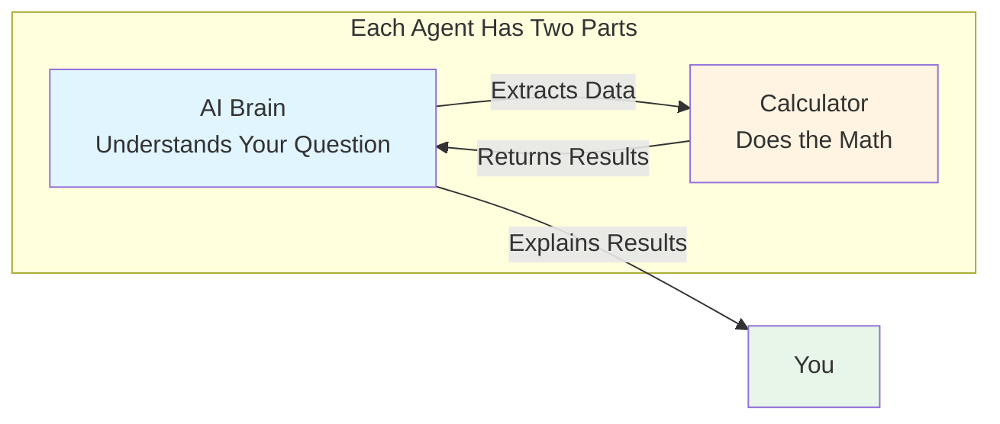

**The AI Brain** (LLM - Large Language Model):
- Understands your natural language questions
- Extracts relevant data from your query
- Asks clarifying questions if needed
- Explains results in plain language

**The Calculator**:
- Performs accurate mathematical calculations
- Uses verified emission factors and benchmarks
- Follows industry standards (GHG Protocol, SBTi)
- Ensures precision and compliance

---

## Understanding AI Agents

### What Makes an Agent "Intelligent"?

An AI agent in our system is like having a **smart assistant** that:

1. **Understands Context**: Uses RAG (Retrieval Augmented Generation) to find relevant information
2. **Remembers**: Learns from past interactions
3. **Validates**: Checks data before calculations
4. **Clarifies**: Asks questions when information is missing
5. **Calculates**: Uses specialized calculators for accurate results
6. **Explains**: Provides clear, understandable responses

### The Three Agents Overview

```mermaid
graph TB
    subgraph "Carbon Accounting Agent"
        CA_AI[AI: Understands<br/>emission queries]
        CA_CALC[Calculator: GHG Protocol<br/>Emission Calculations]
        CA_AI --> CA_CALC
        CA_CALC --> CA_RESULT[Results: Scope 1, 2, 3<br/>emissions in tCO2e]
    end
    
    subgraph "Benchmarking Agent"
        BA_AI[AI: Understands<br/>comparison queries]
        BA_CALC[Calculator: Benchmark<br/>Statistics]
        BA_AI --> BA_CALC
        BA_CALC --> BA_RESULT[Results: Rankings,<br/>percentiles, comparisons]
    end
    
    subgraph "Net Zero Agent"
        NZ_AI[AI: Understands<br/>planning queries]
        NZ_CALC[Calculator: SBTi<br/>Pathway Calculator]
        NZ_AI --> NZ_CALC
        NZ_CALC --> NZ_RESULT[Results: Net-zero plans,<br/>pathways, initiatives]
    end
    
    style CA_AI fill:#e1f5ff
    style CA_CALC fill:#fff4e1
    style BA_AI fill:#e1f5ff
    style BA_CALC fill:#fff4e1
    style NZ_AI fill:#e1f5ff
    style NZ_CALC fill:#fff4e1
```

---

## The Three Specialized Agents

### 1. Carbon Accounting Agent

**Purpose**: Calculate and track carbon emissions following GHG Protocol standards.

**What it does**:
- Calculates Scope 1 (direct emissions), Scope 2 (electricity), and Scope 3 (value chain) emissions
- Uses emission factors from verified databases
- Classifies activities into correct scopes
- Generates emission reports

**Calculator**: **GHG Protocol Calculator**
- Contains emission factors for thousands of activities
- Applies Global Warming Potentials (GWP) for CO2, CH4, N2O
- Handles unit conversions automatically
- Validates calculations against GHG Protocol standards

**Example Query**:
> "Calculate Scope 1 emissions for 1000 liters of diesel fuel used in our fleet"

**How it works**:
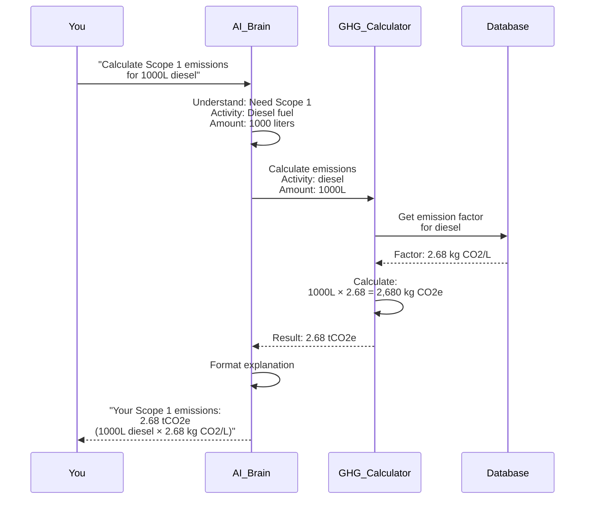

### 2. Benchmarking Agent

**Purpose**: Compare your ESG metrics against industry standards and peers.

**What it does**:
- Compares your metrics to industry averages
- Calculates your percentile ranking
- Identifies gaps and opportunities
- Normalizes metrics for fair comparison

**Calculator**: **Benchmark Statistics Calculator**
- Contains benchmark data for various sectors
- Calculates percentiles (10th, 25th, 50th, 75th, 90th)
- Normalizes metrics by revenue, employees, or other factors
- Compares against peer groups

**Example Query**:
> "How does our carbon intensity compare to the manufacturing industry average?"

**How it works**:
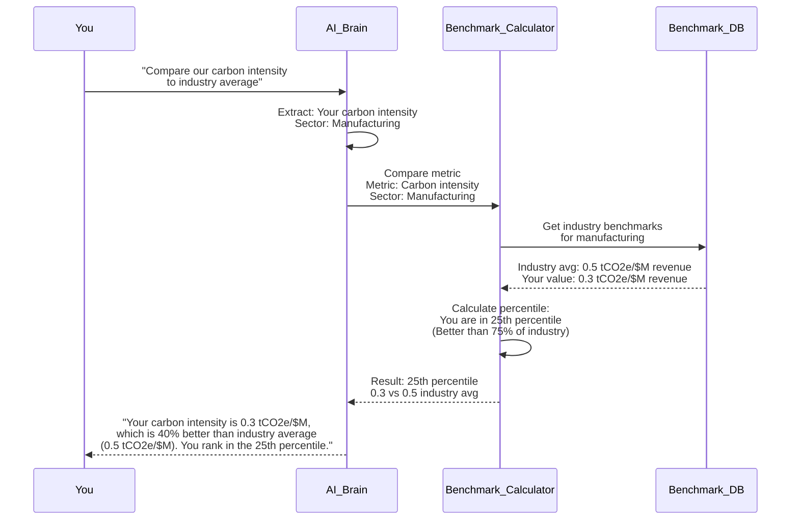

### 3. Net Zero Agent

**Purpose**: Create and validate science-based net-zero plans.

**What it does**:
- Creates net-zero pathways following SBTi methodology
- Calculates annual reduction targets
- Scores and prioritizes decarbonization initiatives
- Validates plan feasibility

**Calculator**: **SBTi Pathway Calculator**
- Applies Science-Based Targets initiative (SBTi) methodology
- Calculates linear and exponential reduction pathways
- Scores initiatives by impact, feasibility, and cost
- Validates targets against 1.5°C scenarios

**Example Query**:
> "Create a net-zero plan to reach zero emissions by 2050"

**How it works**:
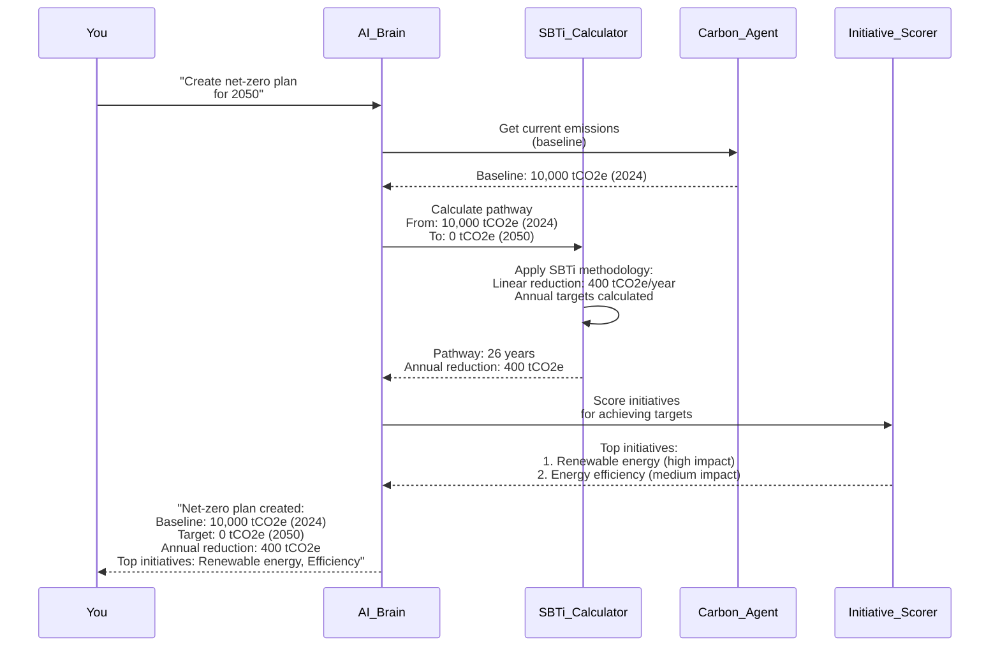

---

## How Agents Work Together

### The Supervisor: Your Project Manager

Think of the Supervisor Agent as a **project manager** who:
- Understands your complex questions
- Breaks them into tasks
- Assigns tasks to the right specialist agent
- Combines results into a complete answer

**Example**: "Calculate our carbon footprint and compare it to industry average"

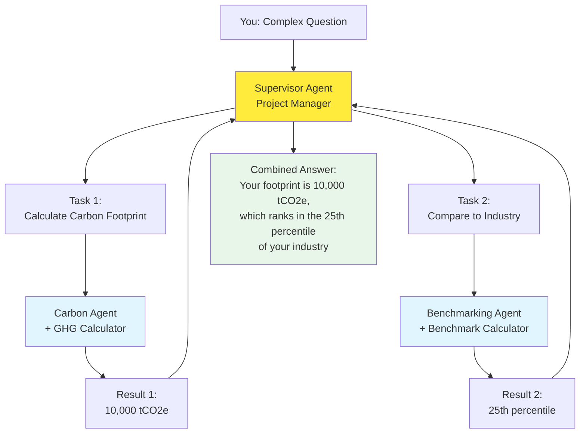

---

## ML Concepts Explained

### What is RAG? (Retrieval Augmented Generation)

**Simple Explanation**: RAG is like having a **research assistant** that:
1. Searches through your knowledge base (documents, reports, standards)
2. Finds relevant information
3. Uses that information to give you accurate answers

**Why it matters for ESG**:
- Your company's historical data
- Industry standards (GHG Protocol, SBTi)
- Emission factor databases
- Benchmark data

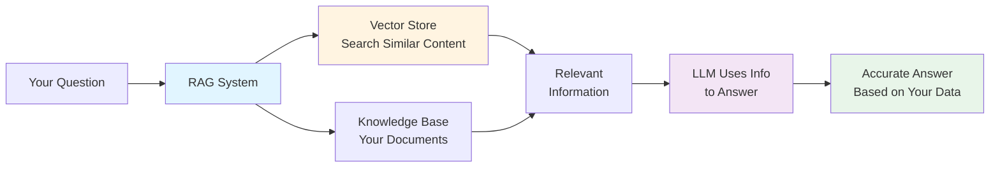

### What is a Vector Store?

**Simple Explanation**: A vector store is like a **smart filing cabinet** that:
- Stores documents as "vectors" (mathematical representations)
- Finds similar documents quickly
- Understands meaning, not just keywords

**Example for ESG**:
- You ask: "What are Scope 3 emissions?"
- Vector store finds: Documents about "value chain emissions", "indirect emissions", "supply chain"
- Even if they don't contain the exact words "Scope 3"

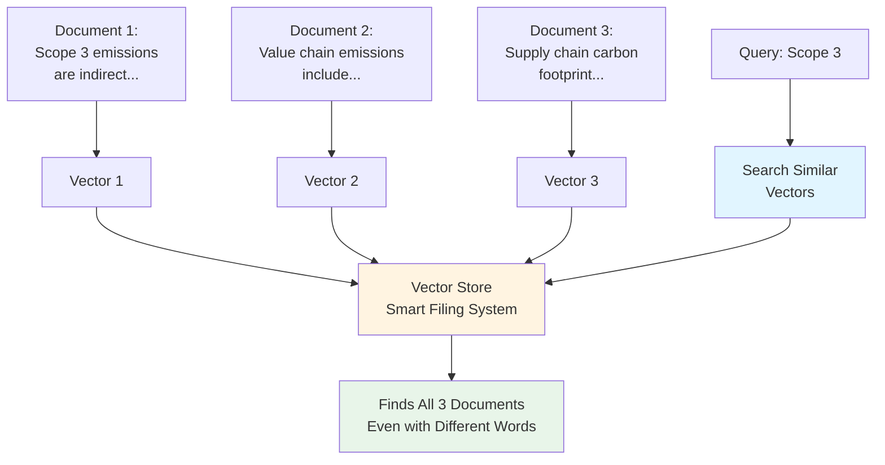

### What is an LLM? (Large Language Model)

**Simple Explanation**: An LLM is the **AI brain** that:
- Understands natural language (your questions in plain English)
- Generates human-like responses
- Learns from vast amounts of text
- In our system: Google's Gemini model

**How it helps in ESG**:
- Understands: "Calculate emissions for our diesel usage"
- Extracts: Activity = diesel, Amount = from your data
- Explains: Results in clear, understandable language

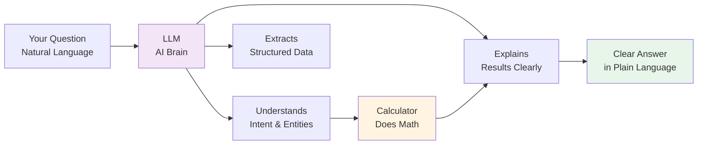

### How RAG + LLM + Calculator Work Together

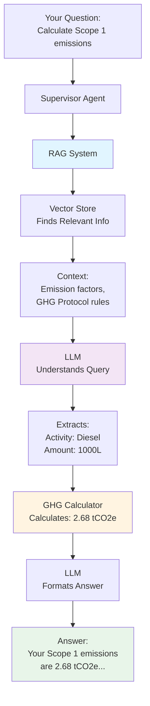

---

## Overview

The Fitsol ESG platform uses a sophisticated multi-agent system where specialized AI agents work together to handle complex ESG queries. Each agent is designed for specific domains (Carbon Accounting, Benchmarking, Net Zero Planning) while sharing common infrastructure for semantic understanding, validation, and learning.

### Key Principles
- **Specialization**: Each agent handles a specific domain with its own calculator
- **Coordination**: Supervisor agent orchestrates multi-agent tasks
- **Intelligence**: Unified semantic understanding with RAG
- **Adaptation**: Continuous learning from user interactions
- **Reliability**: Robust error handling and recovery

---

## Agent System Architecture

### High-Level Agent Architecture

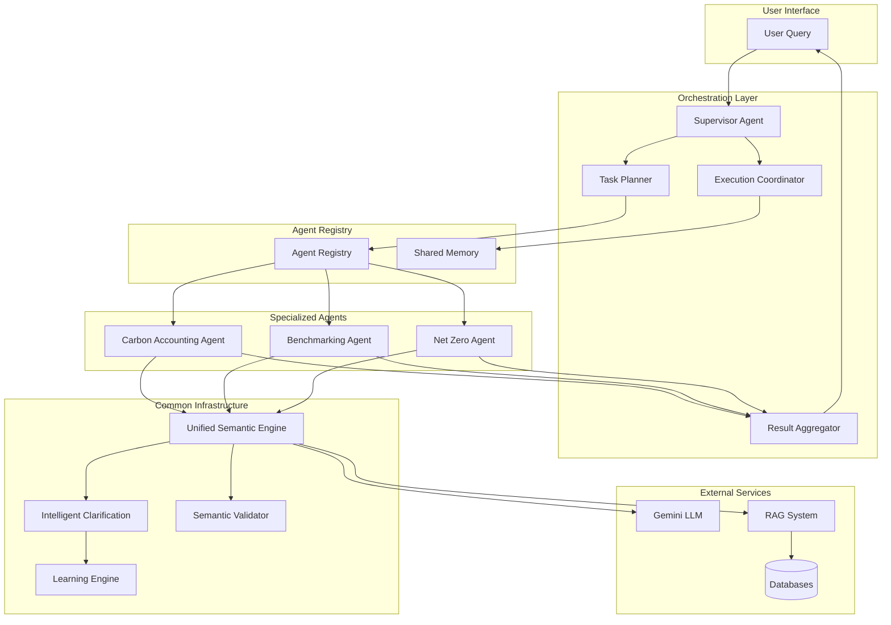

### Agent Class Hierarchy

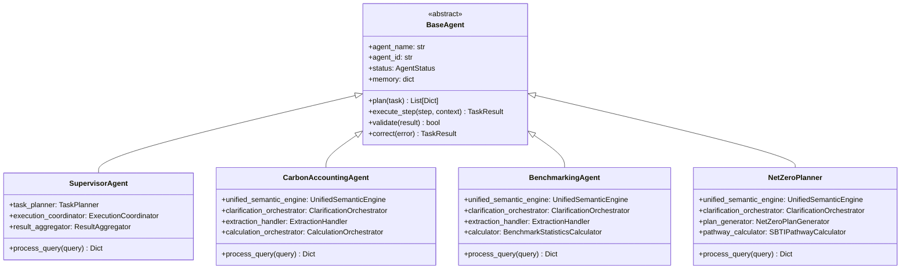

---

## Supervisor Agent

The Supervisor Agent is the central orchestrator that coordinates all other agents. It handles query understanding, task decomposition, agent selection, and result aggregation.

### Supervisor Agent Architecture

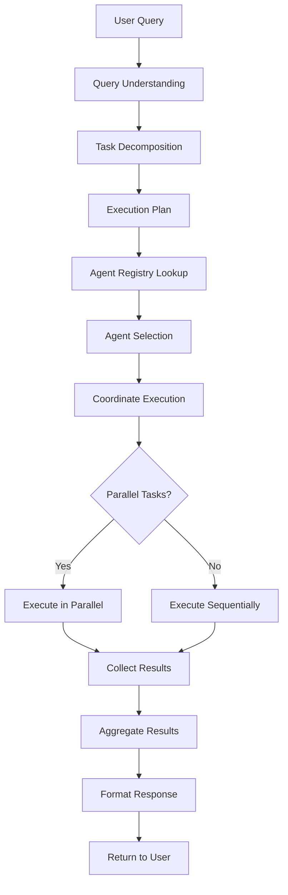

### Supervisor Agent Processing Flow

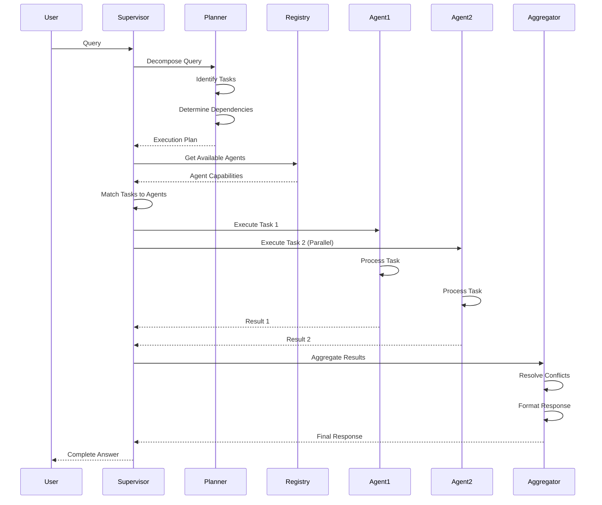

### Task Planning Process

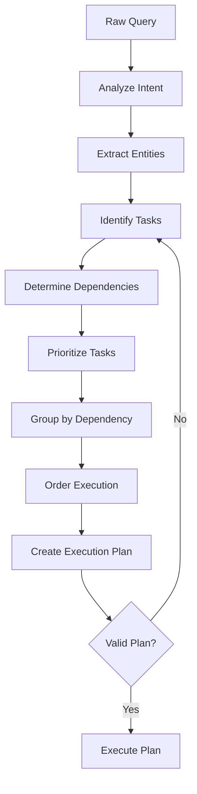

---

## Specialized Agents in Detail

### Carbon Accounting Agent

The Carbon Accounting Agent handles all carbon footprint calculations, emission tracking, and GHG protocol compliance.

#### Carbon Agent Architecture

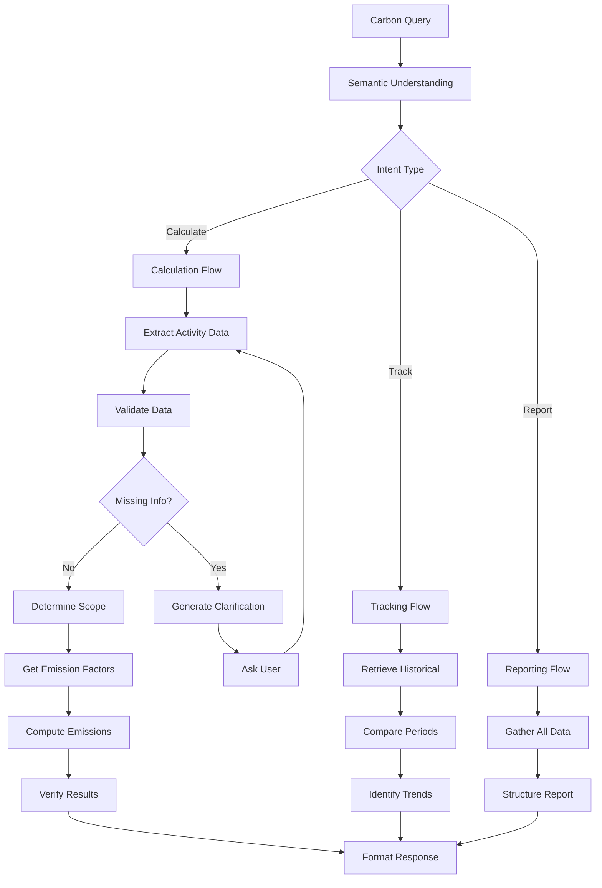

#### Carbon Agent Processing Steps

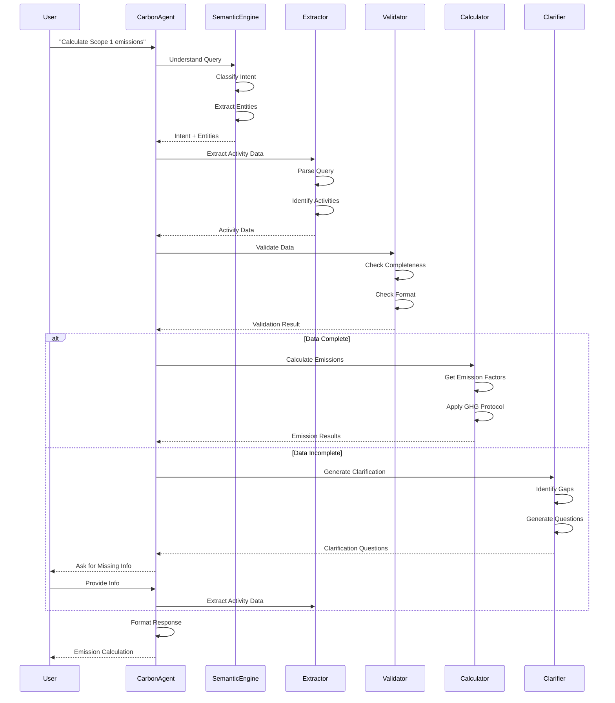

#### Carbon Agent Data Flow

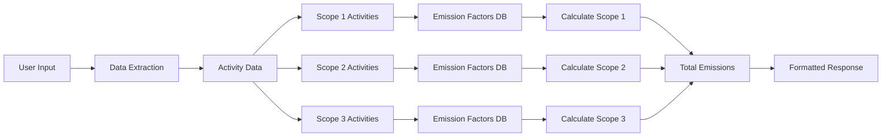

### Benchmarking Agent

The Benchmarking Agent compares ESG metrics against industry standards, peers, and benchmarks.

#### Benchmarking Agent Architecture

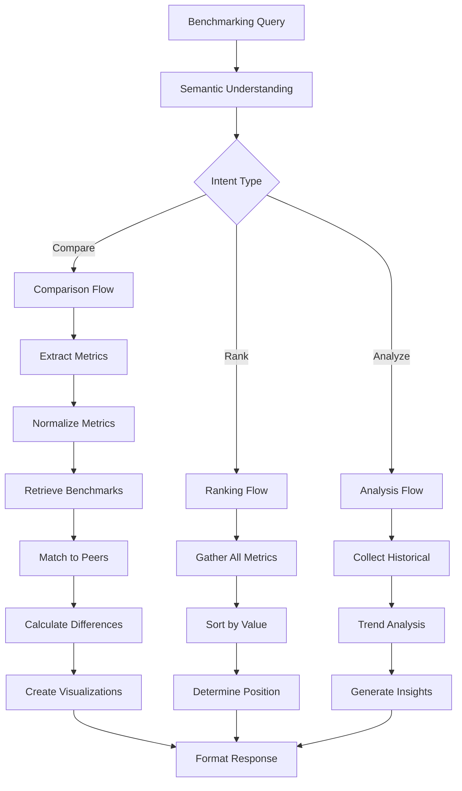

#### Benchmarking Agent Processing Flow

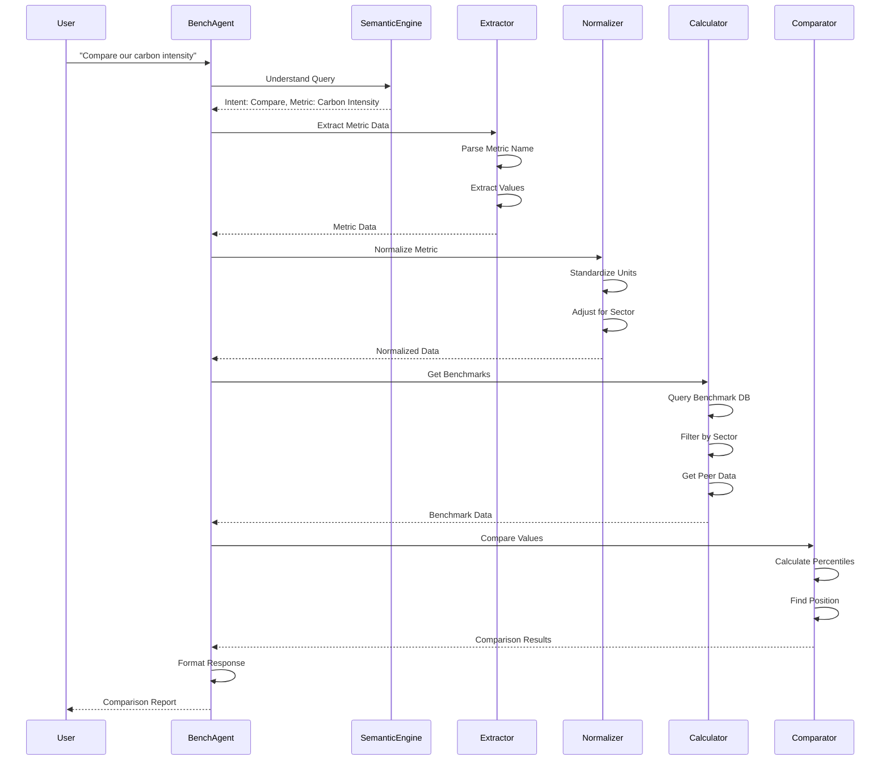

### Net Zero Agent

The Net Zero Agent creates and validates net-zero plans, calculates pathways, and tracks progress.

#### Net Zero Agent Architecture

```mermaid
graph TB
    QUERY[Net Zero Query] --> SEMANTIC[Semantic Understanding]
    SEMANTIC --> INTENT{Intent Type}
    INTENT -->|Create Plan| PLAN[Planning Flow]
    INTENT -->|Validate| VALIDATE[Validation Flow]
    INTENT -->|Track| TRACK[Tracking Flow]
    
    PLAN --> EXTRACT[Extract Goals]
    EXTRACT --> BASELINE[Get Baseline Emissions]
    BASELINE --> PATHWAY[Calculate Pathway]
    PATHWAY --> INITIATIVES[Identify Initiatives]
    INITIATIVES --> SCORE[Score Initiatives]
    SCORE --> PRIORITIZE[Prioritize Actions]
    PRIORITIZE --> TIMELINE[Create Timeline]
    TIMELINE --> FORMAT[Format Plan]
    
    VALIDATE --> LOAD[Load Existing Plan]
    LOAD --> CHECK[Check Feasibility]
    CHECK --> VERIFY[Verify Targets]
    VERIFY --> FORMAT
    
    TRACK --> RETRIEVE[Retrieve Progress]
    RETRIEVE --> COMPARE[Compare to Plan]
    COMPARE --> ADJUST[Suggest Adjustments]
    ADJUST --> FORMAT
```

#### Net Zero Agent Processing Flow

```mermaid
sequenceDiagram
    participant User
    participant NetZeroAgent
    participant SemanticEngine
    participant Extractor
    participant Baseline
    participant Pathway
    participant Planner
    
    User->>NetZeroAgent: "Create net zero plan for 2050"
    NetZeroAgent->>SemanticEngine: Understand Query
    SemanticEngine-->>NetZeroAgent: Intent: Create Plan, Target: 2050
    NetZeroAgent->>Extractor: Extract Requirements
    Extractor->>Extractor: Parse Target Year
    Extractor->>Extractor: Extract Constraints
    Extractor-->>NetZeroAgent: Requirements
    NetZeroAgent->>Baseline: Get Current Emissions
    Baseline->>Baseline: Query Carbon Agent
    Baseline->>Baseline: Get Historical Data
    Baseline-->>NetZeroAgent: Baseline Emissions
    NetZeroAgent->>Pathway: Calculate Pathway
    Pathway->>Pathway: Apply SBTi Methodology
    Pathway->>Pathway: Calculate Annual Targets
    Pathway-->>NetZeroAgent: Pathway Data
    NetZeroAgent->>Planner: Generate Initiatives
    Planner->>Planner: Identify Opportunities
    Planner->>Planner: Score Initiatives
    Planner->>Planner: Create Timeline
    Planner-->>NetZeroAgent: Net Zero Plan
    NetZeroAgent->>NetZeroAgent: Format Response
    NetZeroAgent-->>User: Complete Net Zero Plan
```

---

## Agent Lifecycle

### Agent Initialization

```mermaid
sequenceDiagram
    participant System
    participant Registry
    participant Agent
    participant Config
    participant LLM
    participant Components
    
    System->>Registry: Register Agent
    Registry->>Agent: Initialize
    Agent->>Config: Load Configuration
    Config-->>Agent: Config Data
    Agent->>LLM: Initialize LLM Client
    LLM-->>Agent: LLM Ready
    Agent->>Components: Initialize Components
    Components->>Components: Semantic Engine
    Components->>Components: Clarification Generator
    Components->>Components: Validator
    Components->>Components: Learning Engine
    Components-->>Agent: Components Ready
    Agent->>Registry: Registration Complete
    Registry-->>System: Agent Available
```

### Agent Execution Lifecycle

```mermaid
stateDiagram-v2
    [*] --> Idle
    Idle --> Planning: Receive Query
    Planning --> Understanding: Analyze Query
    Understanding --> Extracting: Extract Data
    Extracting --> Validating: Validate Data
    Validating --> Clarifying: Missing Data
    Validating --> Processing: Data Complete
    Clarifying --> Waiting: Ask User
    Waiting --> Extracting: User Response
    Processing --> Calculating: Perform Calculations
    Calculating --> Formatting: Format Results
    Formatting --> Completed: Return Response
    Completed --> Learning: Update Learning
    Learning --> Idle
    Clarifying --> Error: Timeout
    Processing --> Error: Calculation Error
    Error --> Recovering: Attempt Recovery
    Recovering --> Planning: Retry
    Recovering --> Error: Recovery Failed
    Error --> [*]
```

---

## Agent Communication

### Inter-Agent Communication Pattern

```mermaid
graph TB
    subgraph "Communication Methods"
        MEMORY[Shared Memory]
        MESSAGES[Direct Messages]
        EVENTS[Event Bus]
    end
    
    subgraph "Agents"
        SUPERVISOR[Supervisor]
        CARBON[Carbon Agent]
        BENCH[Benchmarking Agent]
        NETZERO[Net Zero Agent]
    end
    
    SUPERVISOR --> MEMORY
    CARBON --> MEMORY
    BENCH --> MEMORY
    NETZERO --> MEMORY
    
    SUPERVISOR --> MESSAGES
    SUPERVISOR --> CARBON
    SUPERVISOR --> BENCH
    SUPERVISOR --> NETZERO
    
    CARBON --> EVENTS
    BENCH --> EVENTS
    NETZERO --> EVENTS
```

### Shared Memory Structure

```mermaid
graph LR
    MEMORY[Shared Memory] --> CONTEXT[Query Context]
    MEMORY --> RESULTS[Intermediate Results]
    MEMORY --> PREFERENCES[User Preferences]
    MEMORY --> HISTORY[Conversation History]
    
    CONTEXT --> QUERY[Original Query]
    CONTEXT --> ENTITIES[Extracted Entities]
    CONTEXT --> INTENT[Detected Intent]
    
    RESULTS --> CARBON_RES[Carbon Results]
    RESULTS --> BENCH_RES[Benchmark Results]
    RESULTS --> NETZERO_RES[Net Zero Results]
```

---

## Agent Processing Flow

### Unified Semantic Understanding Flow

```mermaid
flowchart TD
    QUERY[User Query] --> RAG[RAG Context Retrieval]
    RAG --> CONTEXT[Enriched Context]
    CONTEXT --> LLM[Unified LLM Call]
    LLM --> INTENT[Intent Classification]
    LLM --> ENTITIES[Entity Extraction]
    LLM --> VALIDATION[Semantic Validation]
    LLM --> GAPS[Gap Analysis]
    LLM --> STRATEGY[Clarification Strategy]
    
    INTENT --> RESULT[Semantic Result]
    ENTITIES --> RESULT
    VALIDATION --> RESULT
    GAPS --> RESULT
    STRATEGY --> RESULT
    
    RESULT --> COMPLETE{Data Complete?}
    COMPLETE -->|Yes| PROCESS[Process Request]
    COMPLETE -->|No| CLARIFY[Generate Clarification]
    CLARIFY --> USER[Ask User]
    USER --> QUERY
```

### Intelligent Clarification Flow

```mermaid
sequenceDiagram
    participant Agent
    participant Clarifier
    participant Tracker
    participant LLM
    participant User
    
    Agent->>Clarifier: Request Clarification
    Clarifier->>Tracker: Get User Preferences
    Tracker-->>Clarifier: Preferences
    Clarifier->>Clarifier: Analyze Gaps
    Clarifier->>LLM: Generate Questions
    LLM->>LLM: Consider Context
    LLM->>LLM: Consider History
    LLM->>LLM: Consider Preferences
    LLM-->>Clarifier: Clarification Questions
    Clarifier->>Clarifier: Prioritize Questions
    Clarifier-->>Agent: Clarification Request
    Agent-->>User: Ask Questions
    User->>Agent: Provide Answers
    Agent->>Tracker: Update Preferences
    Agent->>Agent: Continue Processing
```

### Validation Flow

```mermaid
flowchart TD
    DATA[Extracted Data] --> VALIDATE[Semantic Validator]
    VALIDATE --> CHECK1[Check Completeness]
    CHECK1 --> CHECK2[Check Format]
    CHECK2 --> CHECK3[Check Values]
    CHECK3 --> CHECK4[Check Consistency]
    
    CHECK1 --> RESULT1{Valid?}
    CHECK2 --> RESULT2{Valid?}
    CHECK3 --> RESULT3{Valid?}
    CHECK4 --> RESULT4{Valid?}
    
    RESULT1 -->|No| ERROR1[Missing Fields]
    RESULT2 -->|No| ERROR2[Format Error]
    RESULT3 -->|No| ERROR3[Invalid Values]
    RESULT4 -->|No| ERROR4[Inconsistency]
    
    RESULT1 -->|Yes| PASS[Validation Passed]
    RESULT2 -->|Yes| PASS
    RESULT3 -->|Yes| PASS
    RESULT4 -->|Yes| PASS
    
    ERROR1 --> CLARIFY[Request Clarification]
    ERROR2 --> CLARIFY
    ERROR3 --> CLARIFY
    ERROR4 --> CLARIFY
```

---

## Learning & Adaptation

### Learning Architecture

```mermaid
graph TB
    INTERACTION[User Interaction] --> COLLECT[Learning Data Collector]
    COLLECT --> STORE[Store Interaction Data]
    STORE --> ANALYZE[Pattern Analyzer]
    ANALYZE --> PATTERNS[Identify Patterns]
    PATTERNS --> UPDATE[Model Updater]
    UPDATE --> IMPROVE[Improve Models]
    IMPROVE --> DEPLOY[Deploy Updates]
    DEPLOY --> AGENT[Agent Uses Updated Model]
```

### Learning Data Collection

```mermaid
sequenceDiagram
    participant User
    participant Agent
    participant Collector
    participant Analyzer
    participant Updater
    
    User->>Agent: Query
    Agent->>Agent: Process Query
    Agent-->>User: Response
    Agent->>Collector: Log Interaction
    Collector->>Collector: Store Query
    Collector->>Collector: Store Response
    Collector->>Collector: Store User Feedback
    Collector->>Analyzer: Analyze Patterns
    Analyzer->>Analyzer: Identify Common Patterns
    Analyzer->>Analyzer: Identify Errors
    Analyzer-->>Updater: Pattern Insights
    Updater->>Updater: Update Models
    Updater->>Updater: Update Prompts
    Updater-->>Agent: Updated Configuration
```

### Pattern Analysis Process

```mermaid
flowchart TD
    DATA[Interaction Data] --> CLUSTER[Cluster Similar Queries]
    CLUSTER --> EXTRACT[Extract Patterns]
    EXTRACT --> CATEGORIZE[Categorize Patterns]
    CATEGORIZE --> SUCCESS[Success Patterns]
    CATEGORIZE --> FAILURE[Failure Patterns]
    
    SUCCESS --> REINFORCE[Reinforce Successful Patterns]
    FAILURE --> CORRECT[Identify Corrections]
    
    REINFORCE --> UPDATE[Update Models]
    CORRECT --> UPDATE
    
    UPDATE --> TEST[Test Updates]
    TEST --> DEPLOY{Performance Improved?}
    DEPLOY -->|Yes| APPLY[Apply Updates]
    DEPLOY -->|No| REVERT[Revert Changes]
    APPLY --> MONITOR[Monitor Performance]
    REVERT --> DATA
```

---

## Error Handling & Recovery

### Error Handling Flow

```mermaid
flowchart TD
    EXECUTE[Execute Task] --> TRY[Try Execution]
    TRY --> SUCCESS{Success?}
    SUCCESS -->|Yes| COMPLETE[Task Complete]
    SUCCESS -->|No| CATCH[Catch Exception]
    
    CATCH --> CLASSIFY[Classify Error]
    CLASSIFY --> TYPE1[LLM Error]
    CLASSIFY --> TYPE2[Data Error]
    CLASSIFY --> TYPE3[Calculation Error]
    CLASSIFY --> TYPE4[Network Error]
    
    TYPE1 --> RECOVER1[Retry with Fallback]
    TYPE2 --> RECOVER2[Request Clarification]
    TYPE3 --> RECOVER3[Use Alternative Method]
    TYPE4 --> RECOVER4[Retry with Backoff]
    
    RECOVER1 --> RETRY{Retry Success?}
    RECOVER2 --> RETRY
    RECOVER3 --> RETRY
    RECOVER4 --> RETRY
    
    RETRY -->|Yes| COMPLETE
    RETRY -->|No| ESCALATE[Escalate to Supervisor]
    ESCALATE --> ALTERNATIVE[Try Alternative Agent]
    ALTERNATIVE --> FALLBACK{Success?}
    FALLBACK -->|Yes| COMPLETE
    FALLBACK -->|No| ERROR[Return Error to User]
```

### Error Recovery Strategies

```mermaid
graph TB
    ERROR[Error Detected] --> STRATEGY{Error Type}
    
    STRATEGY -->|LLM Timeout| RETRY1[Retry with Shorter Context]
    STRATEGY -->|Invalid Data| CLARIFY1[Request Data Correction]
    STRATEGY -->|Calculation Error| FALLBACK1[Use Alternative Formula]
    STRATEGY -->|Network Error| BACKOFF[Exponential Backoff]
    
    RETRY1 --> SUCCESS1{Success?}
    CLARIFY1 --> SUCCESS2{Success?}
    FALLBACK1 --> SUCCESS3{Success?}
    BACKOFF --> SUCCESS4{Success?}
    
    SUCCESS1 -->|No| ESCALATE1[Escalate]
    SUCCESS2 -->|No| ESCALATE2[Escalate]
    SUCCESS3 -->|No| ESCALATE3[Escalate]
    SUCCESS4 -->|No| ESCALATE4[Escalate]
    
    ESCALATE1 --> SUPERVISOR[Supervisor Agent]
    ESCALATE2 --> SUPERVISOR
    ESCALATE3 --> SUPERVISOR
    ESCALATE4 --> SUPERVISOR
    
    SUPERVISOR --> ALTERNATIVE[Try Alternative Approach]
```

---

## Performance Optimization

### Agent Performance Optimization

```mermaid
graph TB
    subgraph "Caching Strategy"
        QUERY_CACHE[Query Result Cache]
        CONTEXT_CACHE[Context Cache]
        FACTOR_CACHE[Emission Factor Cache]
    end
    
    subgraph "Parallel Processing"
        PARALLEL_TASKS[Parallel Task Execution]
        ASYNC_LLM[Async LLM Calls]
        BATCH_PROCESS[Batch Processing]
    end
    
    subgraph "Optimization Techniques"
        EARLY_EXIT[Early Exit on Validation]
        LAZY_LOAD[Lazy Loading]
        STREAMING[Streaming Responses]
    end
    
    QUERY_CACHE --> PARALLEL_TASKS
    CONTEXT_CACHE --> ASYNC_LLM
    FACTOR_CACHE --> BATCH_PROCESS
    
    PARALLEL_TASKS --> EARLY_EXIT
    ASYNC_LLM --> LAZY_LOAD
    BATCH_PROCESS --> STREAMING
```

### Response Time Optimization

```mermaid
sequenceDiagram
    participant User
    participant Agent
    participant Cache
    participant LLM
    participant DB
    
    User->>Agent: Query
    Agent->>Cache: Check Cache
    alt Cache Hit
        Cache-->>Agent: Cached Result
        Agent-->>User: Fast Response
    else Cache Miss
        Agent->>Agent: Parallel Processing
        par LLM Call
            Agent->>LLM: Async LLM Request
        and DB Query
            Agent->>DB: Async DB Query
        end
        LLM-->>Agent: LLM Response
        DB-->>Agent: DB Data
        Agent->>Agent: Process Results
        Agent->>Cache: Store Result
        Agent-->>User: Response
    end
```

---

## Agent Capabilities Matrix

### Agent Capabilities Comparison

```mermaid
graph TB
    subgraph "Carbon Accounting Agent"
        CA1[Calculate Emissions]
        CA2[Track Emissions]
        CA3[Generate Reports]
        CA4[Scope Classification]
    end
    
    subgraph "Benchmarking Agent"
        BA1[Compare Metrics]
        BA2[Rank Companies]
        BA3[Analyze Trends]
        BA4[Peer Comparison]
    end
    
    subgraph "Net Zero Agent"
        NZ1[Create Plans]
        NZ2[Validate Plans]
        NZ3[Track Progress]
        NZ4[Pathway Calculation]
    end
    
    subgraph "Common Capabilities"
        CC1[Semantic Understanding]
        CC2[Intelligent Clarification]
        CC3[Data Validation]
        CC4[Learning & Adaptation]
    end
    
    CA1 --> CC1
    CA2 --> CC1
    BA1 --> CC1
    BA2 --> CC1
    NZ1 --> CC1
    NZ2 --> CC1
    
    CA1 --> CC2
    BA1 --> CC2
    NZ1 --> CC2
```

---

## Agent Implementation Details

### Base Agent Class

All agents inherit from `BaseAgent` which provides common functionality:

```python
from abc import ABC, abstractmethod
from typing import Dict, Any, List, Optional
from enum import Enum

class AgentStatus(str, Enum):
    IDLE = "idle"
    PLANNING = "planning"
    EXECUTING = "executing"
    VALIDATING = "validating"
    CORRECTING = "correcting"
    COMPLETED = "completed"
    ERROR = "error"

class BaseAgent(ABC):
    def __init__(self, agent_name: str, agent_id: Optional[str] = None):
        self.agent_name = agent_name
        self.agent_id = agent_id or f"{agent_name}_{id(self)}"
        self.status = AgentStatus.IDLE
        self.memory = {}
        self.task_history: List[Dict[str, Any]] = []
    
    @abstractmethod
    async def plan(self, task: Dict[str, Any]) -> List[Dict[str, Any]]:
        """Plan execution steps for a task."""
        pass
    
    @abstractmethod
    async def execute_step(self, step: Dict[str, Any], context: Dict[str, Any]) -> TaskResult:
        """Execute a single step from the plan."""
        pass
    
    @abstractmethod
    async def validate(self, result: TaskResult) -> bool:
        """Validate the result of task execution."""
        pass
```

### Supervisor Agent Implementation

The Supervisor Agent coordinates multiple agents:

```python
class SupervisorAgent:
    def __init__(self):
        self.task_planner = TaskPlanner()
        self.execution_coordinator = ExecutionCoordinator()
        self.result_aggregator = ResultAggregator()
        self.agent_registry = get_agent_registry()
    
    async def process_query(self, query: str, context: Optional[str] = None) -> Dict[str, Any]:
        # Step 1: Plan tasks
        execution_plan = await self.task_planner.plan(query, context)
        
        # Step 2: Execute tasks
        results = await self.execution_coordinator.execute_plan(execution_plan)
        
        # Step 3: Aggregate results
        aggregated = self.result_aggregator.aggregate(results)
        
        return aggregated
```

### Carbon Agent Implementation

Example of how Carbon Agent processes queries:

```python
class CarbonAccountingAgent:
    async def process_query(self, query: str) -> Dict[str, Any]:
        # 1. Semantic Understanding
        semantic_result = await self.unified_semantic_engine.understand(query)
        
        # 2. Extract Activity Data
        activity_data = await self.extraction_handler.extract(query)
        
        # 3. Validate Data
        validation_result = await self.semantic_validator.validate(activity_data)
        
        if not validation_result.is_complete:
            # 4. Generate Clarification
            clarification = await self.clarification_orchestrator.generate(
                gaps=validation_result.gaps
            )
            return {"type": "clarification", "questions": clarification}
        
        # 5. Calculate Emissions
        emissions = await self.calculation_orchestrator.calculate(activity_data)
        
        # 6. Format Response
        return {
            "type": "result",
            "emissions": emissions,
            "explanation": self._generate_explanation(emissions)
        }
```

### Agent Registry

Agents are registered in a central registry:

```python
class AgentRegistry:
    def __init__(self):
        self.agents: Dict[str, AgentInfo] = {}
    
    def register(self, agent: BaseAgent, capabilities: List[str]):
        self.agents[agent.agent_id] = AgentInfo(
            agent=agent,
            capabilities=capabilities,
            status=AgentHealth.HEALTHY
        )
    
    def find_agent(self, required_capabilities: List[str]) -> Optional[BaseAgent]:
        for agent_info in self.agents.values():
            if all(cap in agent_info.capabilities for cap in required_capabilities):
                return agent_info.agent
        return None
```

## Agent Configuration

### Environment Variables for Agents

```bash
# Enable/Disable Agents
ENABLE_SUPERVISOR_AGENT=true
ENABLE_CARBON_AGENT=true
ENABLE_BENCHMARKING_AGENT=true
ENABLE_NETZERO_AGENT=true

# Agent Features
USE_UNIFIED_SEMANTIC_ENGINE=false
USE_INTELLIGENT_CLARIFICATION=true
USE_SEMANTIC_VALIDATION=true
ENABLE_AGENT_LEARNING=true

# Agent Timeouts
AGENT_TIMEOUT_SECONDS=300
AGENT_RETRY_ATTEMPTS=3
```

### Agent Initialization

Agents are initialized on application startup:

```python
# In main.py or agent initialization module
def initialize_agents():
    # Register Carbon Agent
    carbon_agent = CarbonAccountingAgent()
    agent_registry.register(
        carbon_agent,
        capabilities=["carbon_calculation", "emission_tracking", "scope_classification"]
    )
    
    # Register Benchmarking Agent
    bench_agent = BenchmarkingAgent()
    agent_registry.register(
        bench_agent,
        capabilities=["benchmarking", "peer_comparison", "metric_analysis"]
    )
    
    # Register Net Zero Agent
    netzero_agent = NetZeroPlanner()
    agent_registry.register(
        netzero_agent,
        capabilities=["net_zero_planning", "pathway_calculation", "initiative_scoring"]
    )
```

## Agent Communication Protocols

### Shared Memory Structure

```python
class SharedMemory:
    def __init__(self):
        self.context: Dict[str, Any] = {}
        self.results: Dict[str, Any] = {}
        self.preferences: Dict[str, Any] = {}
        self.history: List[Dict[str, Any]] = []
    
    def write(self, key: str, value: Any, agent_id: str):
        """Write to shared memory with agent context."""
        self.context[f"{agent_id}:{key}"] = value
    
    def read(self, key: str, agent_id: Optional[str] = None) -> Any:
        """Read from shared memory."""
        if agent_id:
            return self.context.get(f"{agent_id}:{key}")
        return self.context.get(key)
```

### Inter-Agent Messaging

```python
class AgentMessage:
    def __init__(self, from_agent: str, to_agent: str, message_type: str, payload: Dict):
        self.from_agent = from_agent
        self.to_agent = to_agent
        self.message_type = message_type
        self.payload = payload
        self.timestamp = datetime.now(timezone.utc)

# Example: Carbon Agent requesting data from Net Zero Agent
message = AgentMessage(
    from_agent="carbon_agent",
    to_agent="netzero_agent",
    message_type="data_request",
    payload={"request": "baseline_emissions", "year": 2024}
)
```

## Agent Testing

### Unit Testing Agents

```python
import pytest
from ml.agents.carbon_accounting.carbon_agent import CarbonAccountingAgent

@pytest.mark.asyncio
async def test_carbon_agent_calculation():
    agent = CarbonAccountingAgent()
    result = await agent.process_query(
        "Calculate Scope 1 emissions for 1000 liters of diesel"
    )
    assert result["type"] == "result"
    assert "emissions" in result
    assert result["emissions"]["total"] > 0
```

### Integration Testing

```python
@pytest.mark.asyncio
async def test_supervisor_coordination():
    supervisor = SupervisorAgent()
    result = await supervisor.process_query(
        "Calculate our carbon footprint and compare it to industry average"
    )
    assert "carbon_result" in result
    assert "benchmark_result" in result
```

## Agent Performance Metrics

### Key Performance Indicators

1. **Response Time**: Average time to process a query
2. **Accuracy**: Percentage of correct responses
3. **Clarification Rate**: Frequency of clarification requests
4. **Error Rate**: Percentage of failed queries
5. **User Satisfaction**: User feedback scores

### Monitoring Agent Performance

```python
class AgentMetrics:
    def __init__(self, agent_id: str):
        self.agent_id = agent_id
        self.query_count = 0
        self.success_count = 0
        self.error_count = 0
        self.avg_response_time = 0.0
        self.clarification_count = 0
    
    def record_query(self, response_time: float, success: bool, clarification: bool):
        self.query_count += 1
        if success:
            self.success_count += 1
        else:
            self.error_count += 1
        if clarification:
            self.clarification_count += 1
        
        # Update average response time
        self.avg_response_time = (
            (self.avg_response_time * (self.query_count - 1) + response_time) 
            / self.query_count
        )
```

## Agent Best Practices

### 1. Error Handling

Always wrap agent operations in try-except blocks:

```python
async def process_query(self, query: str) -> Dict[str, Any]:
    try:
        result = await self._process(query)
        return result
    except LLMError as e:
        return await self._handle_llm_error(e)
    except ValidationError as e:
        return await self._handle_validation_error(e)
    except Exception as e:
        logger.error(f"Unexpected error in {self.agent_name}: {e}")
        return {"error": "An unexpected error occurred"}
```

### 2. Logging

Use structured logging for agent operations:

```python
import logging

logger = logging.getLogger(f"agent.{self.agent_name}")

async def process_query(self, query: str):
    logger.info(f"Processing query: {query[:100]}")
    # ... processing ...
    logger.info(f"Query processed successfully in {duration}s")
```

### 3. Caching

Cache expensive operations:

```python
from functools import lru_cache

@lru_cache(maxsize=100)
def get_emission_factor(activity_type: str, region: str) -> float:
    # Expensive database lookup
    return db.get_emission_factor(activity_type, region)
```

### 4. Async Operations

Use async/await for I/O operations:

```python
async def fetch_data(self, source: str) -> Dict:
    # Use async HTTP client
    async with aiohttp.ClientSession() as session:
        async with session.get(source) as response:
            return await response.json()
```

## Conclusion

The agent system in Fitsol ESG provides:

1. **Intelligent Coordination**: Supervisor agent orchestrates complex multi-agent tasks
2. **Specialized Expertise**: Each agent is optimized for its domain
3. **Unified Understanding**: Shared semantic understanding infrastructure
4. **Adaptive Learning**: Continuous improvement from user interactions
5. **Robust Error Handling**: Multiple recovery strategies for reliability
6. **Performance Optimization**: Caching, parallel processing, and async operations
7. **Extensibility**: Easy to add new agents following the base architecture

The architecture enables the system to handle complex ESG queries efficiently while maintaining high accuracy and user satisfaction through intelligent clarification and continuous learning.

### Adding New Agents

To add a new agent:

1. Create agent class inheriting from `BaseAgent`
2. Implement required abstract methods
3. Register agent in `AgentRegistry`
4. Add agent-specific configuration
5. Write unit and integration tests
6. Update documentation

Example:

```python
class NewDomainAgent(BaseAgent):
    def __init__(self):
        super().__init__("New Domain Agent")
        # Initialize agent-specific components
    
    async def plan(self, task: Dict[str, Any]) -> List[Dict[str, Any]]:
        # Implement planning logic
        pass
    
    async def execute_step(self, step: Dict[str, Any], context: Dict[str, Any]) -> TaskResult:
        # Implement execution logic
        pass
    
    async def validate(self, result: TaskResult) -> bool:
        # Implement validation logic
        pass
```

---

## Summary for ESG Experts

### Key Takeaways

1. **Three Specialized Agents, Three Calculators**:
   - **Carbon Accounting Agent** → GHG Protocol Calculator
   - **Benchmarking Agent** → Benchmark Statistics Calculator  
   - **Net Zero Agent** → SBTi Pathway Calculator

2. **How It Works**:
   - You ask questions in natural language
   - AI (LLM) understands your question
   - RAG finds relevant information from your knowledge base
   - Calculator performs accurate calculations
   - AI explains results clearly

3. **Why This Architecture**:
   - **Accuracy**: Calculators ensure precise, standards-compliant calculations
   - **Intelligence**: AI understands context and explains results
   - **Flexibility**: Can handle complex, multi-part questions
   - **Learning**: System improves from your interactions

4. **ML Concepts You Should Know**:
   - **RAG (Retrieval Augmented Generation)**: Finds relevant information from your documents
   - **Vector Store**: Smart search that understands meaning, not just keywords
   - **LLM (Large Language Model)**: AI brain that understands and explains
   - **Calculator**: Mathematical engine that ensures accuracy

### Real-World Example

**Your Question**: "Calculate our total carbon footprint for 2024 and tell me how we compare to our industry"

**What Happens**:
1. Supervisor Agent breaks this into two tasks
2. Carbon Agent calculates your footprint using GHG Protocol Calculator
3. Benchmarking Agent compares to industry using Benchmark Calculator
4. Results are combined into one clear answer

**Result**: 
> "Your total carbon footprint for 2024 is 10,000 tCO2e (Scope 1: 5,000, Scope 2: 3,000, Scope 3: 2,000). This places you in the 25th percentile of your industry, meaning you're performing better than 75% of similar companies."

### Benefits for ESG Professionals

- **Time Savings**: No manual calculations or data lookups
- **Accuracy**: Follows industry standards automatically
- **Consistency**: Same methodology every time
- **Insights**: Clear explanations and comparisons
- **Scalability**: Handles complex, multi-faceted questions

---

**For Technical Details**: See the sections below for implementation details, code examples, and advanced configuration options.

