# Technical Architecture Documentation

## Table of Contents
1. [System Overview](#system-overview)
2. [High-Level Architecture](#high-level-architecture)
3. [Component Architecture](#component-architecture)
4. [Data Flow](#data-flow)
5. [Technology Stack](#technology-stack)
6. [Database Architecture](#database-architecture)
7. [API Architecture](#api-architecture)
8. [Frontend Architecture](#frontend-architecture)
9. [Agent System Architecture](#agent-system-architecture)
10. [Deployment Architecture](#deployment-architecture)
11. [Security Architecture](#security-architecture)
12. [Scalability & Performance](#scalability--performance)

---

## System Overview

Fitsol ESG is an intelligent ESG (Environmental, Social, and Governance) analytics platform that leverages AI agents to provide carbon accounting, benchmarking, and net-zero planning capabilities. The system is built on a microservices-oriented architecture with a React frontend and FastAPI backend.

### Key Features
- **Multi-Agent System**: Specialized AI agents for different ESG tasks
- **RAG (Retrieval Augmented Generation)**: Context-aware responses using knowledge base
- **Real-time Processing**: Asynchronous task execution and coordination
- **File Processing**: Support for various file formats (CSV, PDF, Excel, etc.)
- **Visualization**: Interactive charts and graphs for ESG metrics
- **User Management**: Role-based access control (RBAC)

### System Requirements

**Backend Requirements:**
- Python 3.10 or higher
- MongoDB 4.4 or higher
- SQLite 3.35 or higher (for reference data)
- 4GB RAM minimum (8GB recommended)
- 10GB disk space minimum

**Frontend Requirements:**
- Node.js 18 or higher
- npm 9 or higher
- Modern web browser (Chrome, Firefox, Safari, Edge)

**External Services:**
- Google Gemini API key (or OpenAI/Anthropic API key)
- MongoDB connection string (local or cloud)

### Architecture Principles

1. **Separation of Concerns**: Clear boundaries between frontend, backend, and data layers
2. **Agent-Based Design**: Modular agents that can work independently or in coordination
3. **Async-First**: Asynchronous processing for better performance and scalability
4. **Type Safety**: TypeScript for frontend, Pydantic for backend validation
5. **API-First**: RESTful API design with clear contracts
6. **Security by Default**: Authentication and authorization at every layer

---

## High-Level Architecture

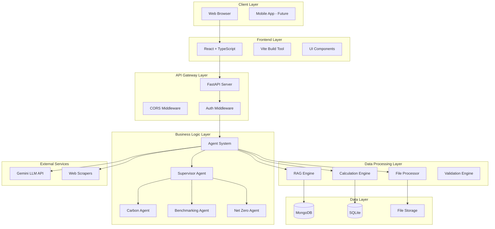
```mermaid
graph TB
    subgraph "Client Layer"
        WEB[Web Browser]
        MOBILE[Mobile App - Future]
    end
    
    subgraph "Frontend Layer"
        REACT[React + TypeScript]
        VITE[Vite Build Tool]
        UI[UI Components]
    end
    
    subgraph "API Gateway Layer"
        FASTAPI[FastAPI Server]
        CORS[CORS Middleware]
        AUTH[Auth Middleware]
    end
    
    subgraph "Business Logic Layer"
        AGENTS[Agent System]
        SUPERVISOR[Supervisor Agent]
        CARBON[Carbon Agent]
        BENCH[Benchmarking Agent]
        NETZERO[Net Zero Agent]
    end
    
    subgraph "Data Processing Layer"
        RAG[RAG Engine]
        FILE[File Processor]
        CALC[Calculation Engine]
        VALID[Validation Engine]
    end
    
    subgraph "Data Layer"
        MONGO[(MongoDB)]
        SQLITE[(SQLite)]
        FILES[File Storage]
    end
    
    subgraph "External Services"
        LLM[Gemini LLM API]
        SCRAPER[Web Scrapers]
    end
    
    WEB --> REACT
    REACT --> FASTAPI
    FASTAPI --> AUTH
    AUTH --> AGENTS
    AGENTS --> SUPERVISOR
    SUPERVISOR --> CARBON
    SUPERVISOR --> BENCH
    SUPERVISOR --> NETZERO
    AGENTS --> RAG
    AGENTS --> CALC
    AGENTS --> FILE
    RAG --> MONGO
    CALC --> SQLITE
    FILE --> FILES
    AGENTS --> LLM
    AGENTS --> SCRAPER
```

---

## Component Architecture

### Backend Components

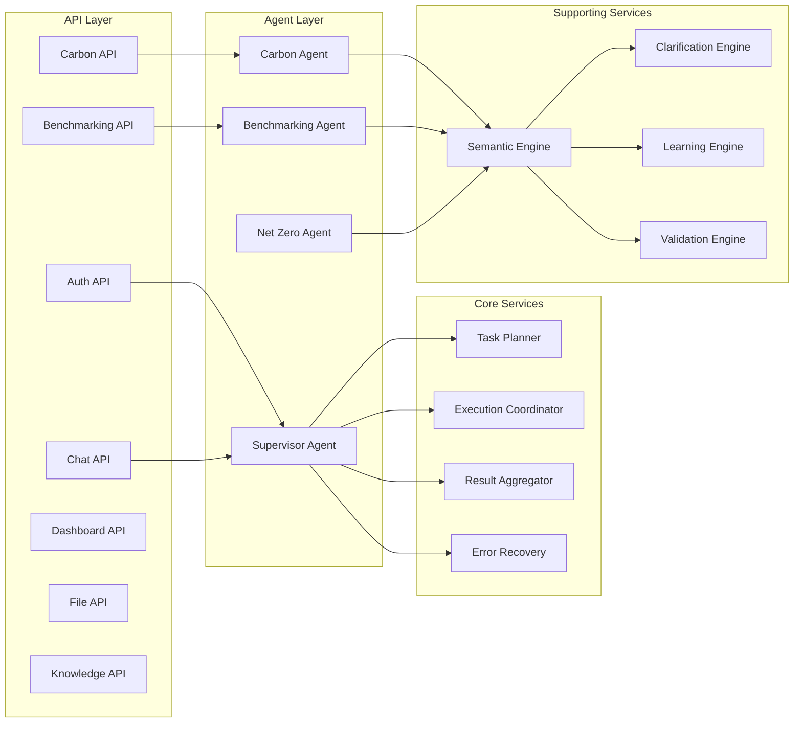
```mermaid
graph LR
    subgraph "API Layer"
        A1[Auth API]
        A2[Chat API]
        A3[Carbon API]
        A4[Benchmarking API]
        A5[Dashboard API]
        A6[File API]
        A7[Knowledge API]
    end
    
    subgraph "Agent Layer"
        AG1[Supervisor Agent]
        AG2[Carbon Agent]
        AG3[Benchmarking Agent]
        AG4[Net Zero Agent]
    end
    
    subgraph "Core Services"
        S1[Task Planner]
        S2[Execution Coordinator]
        S3[Result Aggregator]
        S4[Error Recovery]
    end
    
    subgraph "Supporting Services"
        SS1[Semantic Engine]
        SS2[Clarification Engine]
        SS3[Learning Engine]
        SS4[Validation Engine]
    end
    
    A1 --> AG1
    A2 --> AG1
    A3 --> AG2
    A4 --> AG3
    AG1 --> S1
    AG1 --> S2
    AG1 --> S3
    AG1 --> S4
    AG2 --> SS1
    AG3 --> SS1
    AG4 --> SS1
    SS1 --> SS2
    SS1 --> SS3
    SS1 --> SS4
```

### Frontend Components

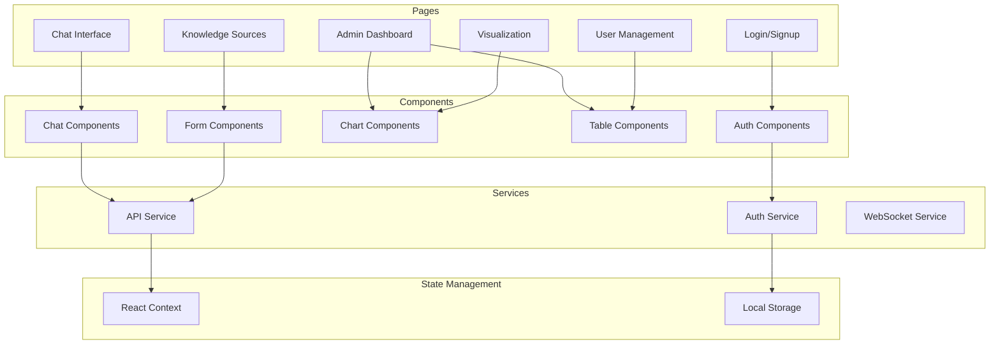
```mermaid
graph TB
    subgraph "Pages"
        P1[Login/Signup]
        P2[Chat Interface]
        P3[Admin Dashboard]
        P4[User Management]
        P5[Knowledge Sources]
        P6[Visualization]
    end
    
    subgraph "Components"
        C1[Chat Components]
        C2[Form Components]
        C3[Chart Components]
        C4[Table Components]
        C5[Auth Components]
    end
    
    subgraph "Services"
        S1[API Service]
        S2[Auth Service]
        S3[WebSocket Service]
    end
    
    subgraph "State Management"
        ST1[React Context]
        ST2[Local Storage]
    end
    
    P1 --> C5
    P2 --> C1
    P3 --> C3
    P3 --> C4
    P4 --> C4
    P5 --> C2
    P6 --> C3
    C1 --> S1
    C2 --> S1
    C5 --> S2
    S1 --> ST1
    S2 --> ST2
```

---

## Data Flow

### Request Flow

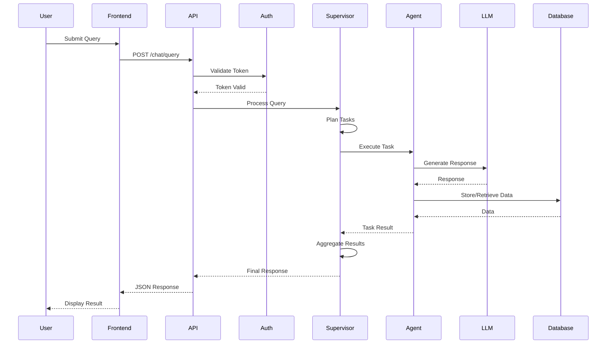
```mermaid
sequenceDiagram
    participant User
    participant Frontend
    participant API
    participant Auth
    participant Supervisor
    participant Agent
    participant LLM
    participant Database
    
    User->>Frontend: Submit Query
    Frontend->>API: POST /chat/query
    API->>Auth: Validate Token
    Auth-->>API: Token Valid
    API->>Supervisor: Process Query
    Supervisor->>Supervisor: Plan Tasks
    Supervisor->>Agent: Execute Task
    Agent->>LLM: Generate Response
    LLM-->>Agent: Response
    Agent->>Database: Store/Retrieve Data
    Database-->>Agent: Data
    Agent-->>Supervisor: Task Result
    Supervisor->>Supervisor: Aggregate Results
    Supervisor-->>API: Final Response
    API-->>Frontend: JSON Response
    Frontend-->>User: Display Result
```

### Agent Processing Flow

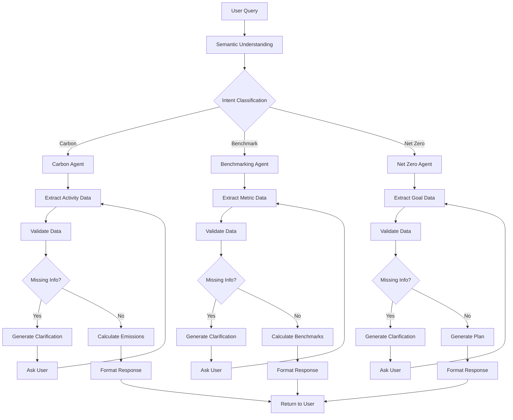
```mermaid
flowchart TD
    START[User Query] --> UNDERSTAND[Semantic Understanding]
    UNDERSTAND --> INTENT{Intent Classification}
    INTENT -->|Carbon| CARBON[Carbon Agent]
    INTENT -->|Benchmark| BENCH[Benchmarking Agent]
    INTENT -->|Net Zero| NETZERO[Net Zero Agent]
    
    CARBON --> EXTRACT1[Extract Activity Data]
    BENCH --> EXTRACT2[Extract Metric Data]
    NETZERO --> EXTRACT3[Extract Goal Data]
    
    EXTRACT1 --> VALIDATE1[Validate Data]
    EXTRACT2 --> VALIDATE2[Validate Data]
    EXTRACT3 --> VALIDATE3[Validate Data]
    
    VALIDATE1 --> MISSING1{Missing Info?}
    VALIDATE2 --> MISSING2{Missing Info?}
    VALIDATE3 --> MISSING3{Missing Info?}
    
    MISSING1 -->|Yes| CLARIFY1[Generate Clarification]
    MISSING2 -->|Yes| CLARIFY2[Generate Clarification]
    MISSING3 -->|Yes| CLARIFY3[Generate Clarification]
    
    CLARIFY1 --> USER1[Ask User]
    CLARIFY2 --> USER2[Ask User]
    CLARIFY3 --> USER3[Ask User]
    
    USER1 --> EXTRACT1
    USER2 --> EXTRACT2
    USER3 --> EXTRACT3
    
    MISSING1 -->|No| CALC1[Calculate Emissions]
    MISSING2 -->|No| CALC2[Calculate Benchmarks]
    MISSING3 -->|No| CALC3[Generate Plan]
    
    CALC1 --> RESPONSE1[Format Response]
    CALC2 --> RESPONSE2[Format Response]
    CALC3 --> RESPONSE3[Format Response]
    
    RESPONSE1 --> END[Return to User]
    RESPONSE2 --> END
    RESPONSE3 --> END
```

---

## Technology Stack

### Backend Stack

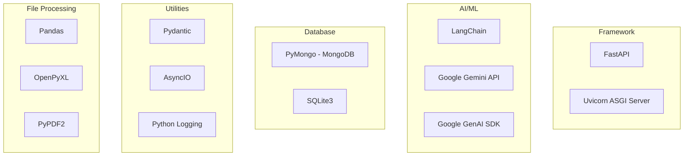
```mermaid
graph TB
    subgraph "Framework"
        FASTAPI[FastAPI]
        UVICORN[Uvicorn ASGI Server]
    end
    
    subgraph "AI/ML"
        LANGCHAIN[LangChain]
        GEMINI[Google Gemini API]
        GENAI[Google GenAI SDK]
    end
    
    subgraph "Database"
        MONGO[PyMongo - MongoDB]
        SQLITE[SQLite3]
    end
    
    subgraph "Utilities"
        PYDANTIC[Pydantic]
        ASYNC[AsyncIO]
        LOGGING[Python Logging]
    end
    
    subgraph "File Processing"
        PANDAS[Pandas]
        OPENPYXL[OpenPyXL]
        PDFLIB[PyPDF2]
    end
```

#### Backend Dependencies

**Core Framework:**
- `fastapi[standard]` - Modern web framework for building APIs
- `uvicorn[standard]>=0.27.0` - ASGI server implementation

**AI/ML Libraries:**
- `langchain==1.0.5` - LLM application framework
- `langchain-google-genai==3.0.1` - Google Gemini integration
- `google-genai==1.49.0` - Google Generative AI SDK
- `sentence-transformers>=2.2.0` - Embedding models for RAG

**Database:**
- `pymongo>=4.11.3` - MongoDB driver
- `sqlite3` - Built-in SQLite support

**Data Processing:**
- `pandas==2.2.3` - Data manipulation
- `numpy==1.26.4` - Numerical computing
- `openpyxl>=3.1.2` - Excel file processing
- `pypdf==5.4.0` - PDF processing
- `python-docx>=0.8.11` - Word document processing

**Authentication & Security:**
- `PyJWT>=2.8.0` - JWT token handling
- `bcrypt>=4.0.1` - Password hashing
- `python-jose[cryptography]>=3.3.0` - JWT encoding/decoding

**Vector Stores:**
- `faiss-cpu>=1.7.4` - Vector similarity search

### Frontend Stack

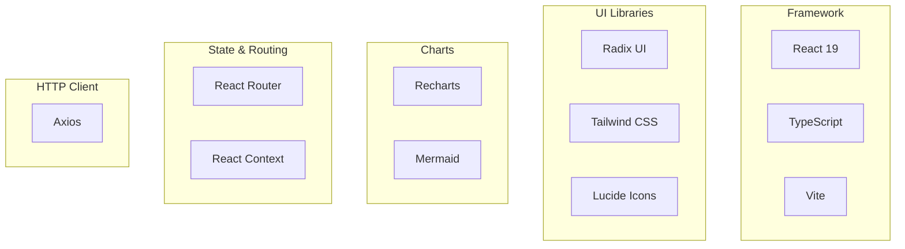
```mermaid
graph TB
    subgraph "Framework"
        REACT[React 19]
        TYPESCRIPT[TypeScript]
        VITE[Vite]
    end
    
    subgraph "UI Libraries"
        RADIX[Radix UI]
        TAILWIND[Tailwind CSS]
        LUCIDE[Lucide Icons]
    end
    
    subgraph "Charts"
        RECHARTS[Recharts]
        MERMAID[Mermaid]
    end
    
    subgraph "State & Routing"
        ROUTER[React Router]
        CONTEXT[React Context]
    end
    
    subgraph "HTTP Client"
        AXIOS[Axios]
    end
```

#### Frontend Dependencies

**Core Framework:**
- `react@^19.0.0` - UI library
- `react-dom@^19.0.0` - React DOM renderer
- `typescript~5.7.2` - Type safety
- `vite@^6.2.0` - Build tool and dev server

**UI Components:**
- `@radix-ui/react-*` - Accessible component primitives
- `tailwindcss@^4.1.3` - Utility-first CSS
- `lucide-react@^0.488.0` - Icon library

**Data Visualization:**
- `recharts@^2.15.3` - Chart library
- `mermaid@^11.6.0` - Diagram rendering

**HTTP & State:**
- `axios@^1.8.4` - HTTP client
- `react-router@^7.5.0` - Routing
- React Context API for state management

**Form Handling:**
- `react-hook-form@^7.56.1` - Form state management
- `zod@^3.24.3` - Schema validation

---

## Database Architecture

### MongoDB Collections

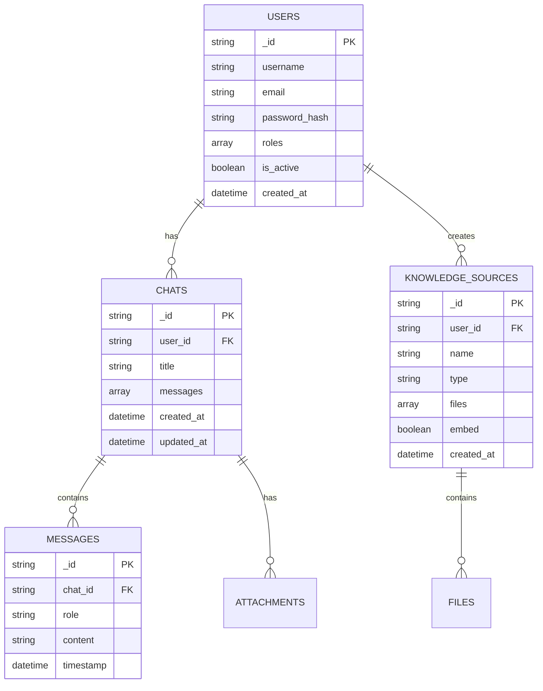
```mermaid
erDiagram
    USERS ||--o{ CHATS : has
    USERS ||--o{ KNOWLEDGE_SOURCES : creates
    CHATS ||--o{ MESSAGES : contains
    KNOWLEDGE_SOURCES ||--o{ FILES : contains
    CHATS ||--o{ ATTACHMENTS : has
    
    USERS {
        string _id PK
        string username
        string email
        string password_hash
        array roles
        boolean is_active
        datetime created_at
    }
    
    CHATS {
        string _id PK
        string user_id FK
        string title
        array messages
        datetime created_at
        datetime updated_at
    }
    
    KNOWLEDGE_SOURCES {
        string _id PK
        string user_id FK
        string name
        string type
        array files
        boolean embed
        datetime created_at
    }
    
    MESSAGES {
        string _id PK
        string chat_id FK
        string role
        string content
        datetime timestamp
    }
```

#### MongoDB Schema Details

**Users Collection:**
```python
{
    "_id": ObjectId,
    "username": str,  # Unique, 3-50 characters
    "email": str,      # Unique, validated email
    "password_hash": str,  # bcrypt hashed
    "roles": List[str],  # ["user"] or ["admin"]
    "is_active": bool,
    "created_at": datetime,
    "last_active": Optional[datetime]
}
```

**Chats Collection:**
```python
{
    "_id": ObjectId,
    "user_id": str,  # Reference to users._id
    "title": str,
    "messages": List[Dict],  # Array of message objects
    "created_at": datetime,
    "updated_at": datetime
}
```

**Knowledge Sources Collection:**
```python
{
    "_id": ObjectId,
    "user_id": str,
    "name": str,
    "type": str,  # "file", "url", "text"
    "files": List[Dict],  # File metadata
    "embed": bool,  # Whether to create embeddings
    "created_at": datetime,
    "updated_at": datetime
}
```

**Indexes:**
- `users.email` - Unique index
- `users.username` - Unique index
- `chats.user_id` - Index for user queries
- `knowledge_sources.user_id` - Index for user queries

### SQLite Databases

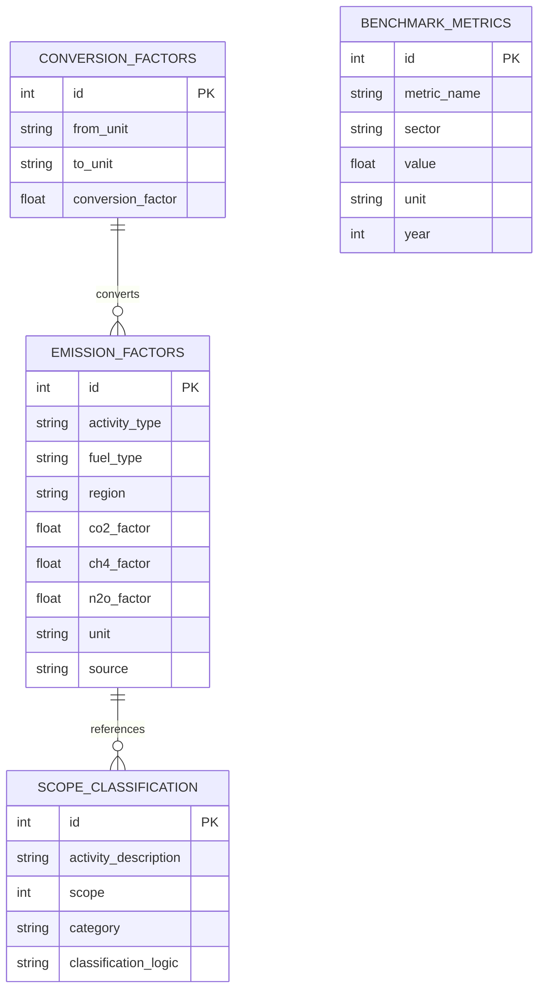
```mermaid
erDiagram
    EMISSION_FACTORS ||--o{ SCOPE_CLASSIFICATION : references
    CONVERSION_FACTORS ||--o{ EMISSION_FACTORS : converts
    
    EMISSION_FACTORS {
        int id PK
        string activity_type
        string fuel_type
        string region
        float co2_factor
        float ch4_factor
        float n2o_factor
        string unit
        string source
    }
    
    SCOPE_CLASSIFICATION {
        int id PK
        string activity_description
        int scope
        string category
        string classification_logic
    }
    
    CONVERSION_FACTORS {
        int id PK
        string from_unit
        string to_unit
        float conversion_factor
    }
    
    BENCHMARK_METRICS {
        int id PK
        string metric_name
        string sector
        float value
        string unit
        int year
    }
```

#### SQLite Schema Details

**Emission Factors Table:**
```sql
CREATE TABLE emission_factors (
    id INTEGER PRIMARY KEY AUTOINCREMENT,
    activity_type TEXT NOT NULL,
    fuel_type TEXT,
    region TEXT,
    sector TEXT,
    co2_factor REAL NOT NULL,
    ch4_factor REAL DEFAULT 0.0,
    n2o_factor REAL DEFAULT 0.0,
    unit TEXT NOT NULL,
    source TEXT NOT NULL,
    year INTEGER,
    confidence_level REAL DEFAULT 0.8,
    notes TEXT,
    created_at TIMESTAMP DEFAULT CURRENT_TIMESTAMP,
    updated_at TIMESTAMP DEFAULT CURRENT_TIMESTAMP
);
```

**Scope Classification Table:**
```sql
CREATE TABLE scope_classification (
    id INTEGER PRIMARY KEY AUTOINCREMENT,
    activity_description TEXT NOT NULL,
    scope INTEGER NOT NULL CHECK(scope IN (1, 2, 3)),
    category TEXT,
    classification_logic TEXT,
    examples TEXT,
    created_at TIMESTAMP DEFAULT CURRENT_TIMESTAMP
);
```

**Conversion Factors Table:**
```sql
CREATE TABLE conversion_factors (
    id INTEGER PRIMARY KEY AUTOINCREMENT,
    from_unit TEXT NOT NULL,
    to_unit TEXT NOT NULL,
    conversion_factor REAL NOT NULL,
    category TEXT,
    notes TEXT,
    created_at TIMESTAMP DEFAULT CURRENT_TIMESTAMP,
    UNIQUE(from_unit, to_unit)
);
```

**Benchmark Metrics Table:**
```sql
CREATE TABLE benchmark_metrics (
    id INTEGER PRIMARY KEY AUTOINCREMENT,
    metric_name TEXT NOT NULL,
    sector TEXT,
    value REAL NOT NULL,
    unit TEXT NOT NULL,
    year INTEGER,
    source TEXT,
    created_at TIMESTAMP DEFAULT CURRENT_TIMESTAMP
);
```

---

## API Architecture

### API Endpoints Structure

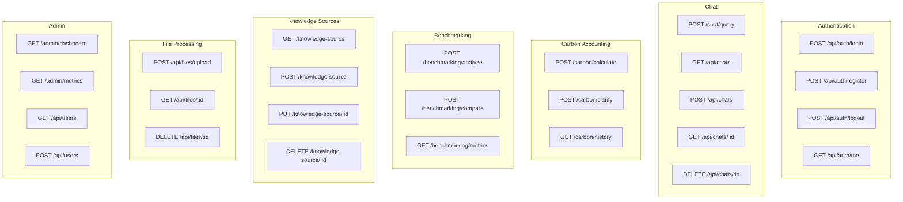
```mermaid
graph TB
    subgraph "Authentication"
        AUTH1[POST /api/auth/login]
        AUTH2[POST /api/auth/register]
        AUTH3[POST /api/auth/logout]
        AUTH4[GET /api/auth/me]
    end
    
    subgraph "Chat"
        CHAT1[POST /chat/query]
        CHAT2[GET /api/chats]
        CHAT3[POST /api/chats]
        CHAT4[GET /api/chats/:id]
        CHAT5[DELETE /api/chats/:id]
    end
    
    subgraph "Carbon Accounting"
        CARBON1[POST /carbon/calculate]
        CARBON2[POST /carbon/clarify]
        CARBON3[GET /carbon/history]
    end
    
    subgraph "Benchmarking"
        BENCH1[POST /benchmarking/analyze]
        BENCH2[POST /benchmarking/compare]
        BENCH3[GET /benchmarking/metrics]
    end
    
    subgraph "Knowledge Sources"
        KNOW1[GET /knowledge-source]
        KNOW2[POST /knowledge-source]
        KNOW3[PUT /knowledge-source/:id]
        KNOW4[DELETE /knowledge-source/:id]
    end
    
    subgraph "File Processing"
        FILE1[POST /api/files/upload]
        FILE2[GET /api/files/:id]
        FILE3[DELETE /api/files/:id]
    end
    
    subgraph "Admin"
        ADMIN1[GET /admin/dashboard]
        ADMIN2[GET /admin/metrics]
        ADMIN3[GET /api/users]
        ADMIN4[POST /api/users]
    end
```

### API Endpoint Details

#### Authentication Endpoints

**POST /api/auth/login**
- **Description**: Authenticate user and receive JWT token
- **Request Body**:
```json
{
  "username": "string",
  "password": "string"
}
```
- **Response**:
```json
{
  "access_token": "string",
  "token_type": "bearer",
  "user": {
    "user_id": "string",
    "username": "string",
    "email": "string",
    "roles": ["user"]
  }
}
```

**POST /api/auth/register**
- **Description**: Register a new user
- **Request Body**:
```json
{
  "username": "string",
  "email": "string",
  "password": "string"
}
```

**GET /api/auth/me**
- **Description**: Get current user information
- **Headers**: `Authorization: Bearer <token>`
- **Response**: User object

#### Chat Endpoints

**POST /chat/query**
- **Description**: Send a query to the AI agent system
- **Request Body**:
```json
{
  "query": "string",
  "chat_id": "string (optional)",
  "context": "string (optional)",
  "conversation_memory": "string (optional)",
  "file_attachments": ["string"] (optional)
}
```
- **Response**: Streaming response with agent results

**GET /api/chats**
- **Description**: Get all chats for the current user
- **Query Parameters**: `limit`, `offset`
- **Response**: Array of chat objects

#### Carbon Accounting Endpoints

**POST /carbon/calculate**
- **Description**: Calculate carbon footprint from natural language query
- **Request Body**:
```json
{
  "query": "Calculate Scope 1 emissions for 1000 liters of diesel",
  "context": "string (optional)",
  "conversation_memory": "string (optional)"
}
```
- **Response**:
```json
{
  "result": {
    "total_emissions": 2.68,
    "unit": "tCO2e",
    "breakdown": {
      "scope1": 2.68,
      "scope2": 0.0,
      "scope3": 0.0
    },
    "explanation": "string"
  }
}
```

#### Benchmarking Endpoints

**POST /benchmarking/analyze**
- **Description**: Analyze ESG metrics against benchmarks
- **Request Body**:
```json
{
  "query": "Compare our carbon intensity to industry average",
  "metric": "carbon_intensity",
  "sector": "manufacturing"
}
```

### API Response Format

All API responses follow a consistent format:

**Success Response:**
```json
{
  "success": true,
  "data": { ... },
  "message": "string (optional)"
}
```

**Error Response:**
```json
{
  "success": false,
  "error": {
    "code": "ERROR_CODE",
    "message": "Human-readable error message",
    "details": { ... } (optional)
  }
}
```

### Authentication

The API uses JWT (JSON Web Tokens) for authentication:

1. User logs in via `/api/auth/login`
2. Server returns JWT token
3. Client includes token in `Authorization` header: `Bearer <token>`
4. Token expires after 24 hours (configurable)
5. Refresh token available for 7 days

### Rate Limiting

- **Public Endpoints**: 100 requests per minute
- **Authenticated Endpoints**: 1000 requests per minute
- **Admin Endpoints**: 5000 requests per minute

### API Request/Response Flow

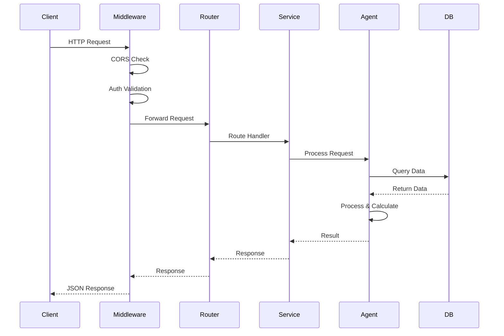
```mermaid
sequenceDiagram
    participant Client
    participant Middleware
    participant Router
    participant Service
    participant Agent
    participant DB
    
    Client->>Middleware: HTTP Request
    Middleware->>Middleware: CORS Check
    Middleware->>Middleware: Auth Validation
    Middleware->>Router: Forward Request
    Router->>Service: Route Handler
    Service->>Agent: Process Request
    Agent->>DB: Query Data
    DB-->>Agent: Return Data
    Agent->>Agent: Process & Calculate
    Agent-->>Service: Result
    Service-->>Router: Response
    Router-->>Middleware: Response
    Middleware-->>Client: JSON Response
```

---

## Frontend Architecture

### Component Hierarchy

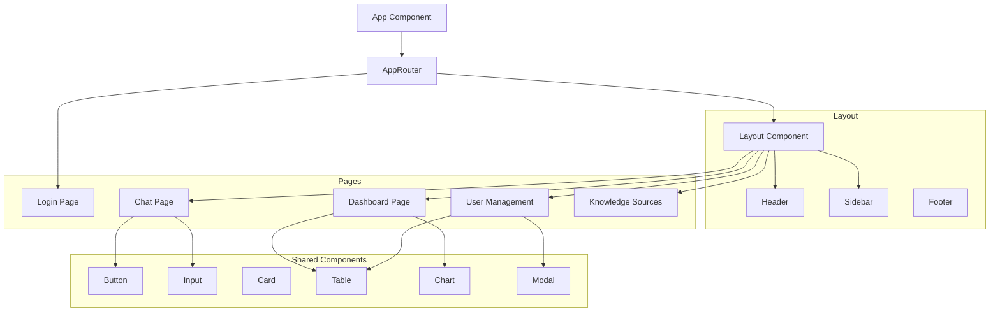
```mermaid
graph TB
    APP[App Component]
    ROUTER[AppRouter]
    
    subgraph "Layout"
        LAYOUT[Layout Component]
        HEADER[Header]
        SIDEBAR[Sidebar]
        FOOTER[Footer]
    end
    
    subgraph "Pages"
        LOGIN[Login Page]
        CHAT[Chat Page]
        DASHBOARD[Dashboard Page]
        USERS[User Management]
        SOURCES[Knowledge Sources]
    end
    
    subgraph "Shared Components"
        BUTTON[Button]
        INPUT[Input]
        CARD[Card]
        TABLE[Table]
        CHART[Chart]
        MODAL[Modal]
    end
    
    APP --> ROUTER
    ROUTER --> LOGIN
    ROUTER --> LAYOUT
    LAYOUT --> HEADER
    LAYOUT --> SIDEBAR
    LAYOUT --> CHAT
    LAYOUT --> DASHBOARD
    LAYOUT --> USERS
    LAYOUT --> SOURCES
    CHAT --> BUTTON
    CHAT --> INPUT
    DASHBOARD --> CHART
    DASHBOARD --> TABLE
    USERS --> TABLE
    USERS --> MODAL
```

### State Management Flow

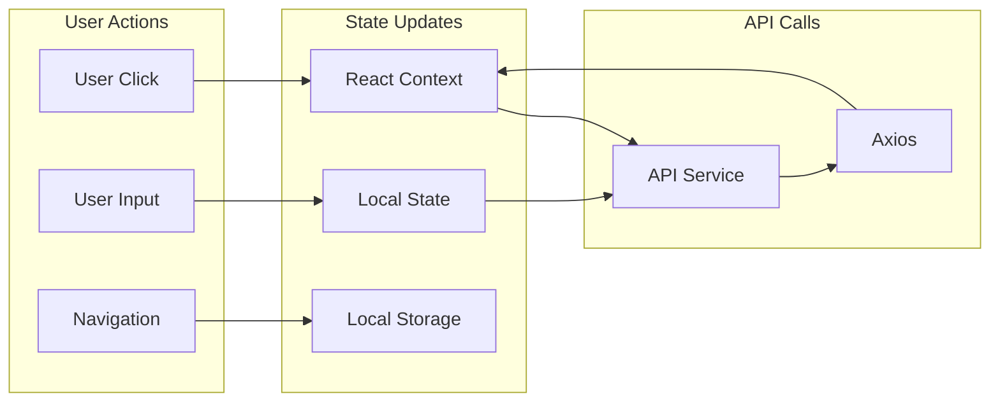
```mermaid
graph LR
    subgraph "User Actions"
        CLICK[User Click]
        INPUT[User Input]
        NAV[Navigation]
    end
    
    subgraph "State Updates"
        CONTEXT[React Context]
        LOCAL[Local State]
        STORAGE[Local Storage]
    end
    
    subgraph "API Calls"
        SERVICE[API Service]
        AXIOS[Axios]
    end
    
    CLICK --> CONTEXT
    INPUT --> LOCAL
    NAV --> STORAGE
    CONTEXT --> SERVICE
    LOCAL --> SERVICE
    SERVICE --> AXIOS
    AXIOS --> CONTEXT
```

---

## Agent System Architecture

### Agent Hierarchy

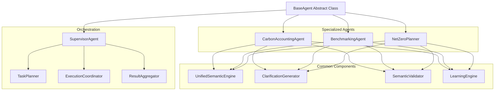
```mermaid
graph TB
    BASE[BaseAgent Abstract Class]
    
    subgraph "Orchestration"
        SUPERVISOR[SupervisorAgent]
        TASKPLAN[TaskPlanner]
        EXECCOORD[ExecutionCoordinator]
        RESULTAGG[ResultAggregator]
    end
    
    subgraph "Specialized Agents"
        CARBON[CarbonAccountingAgent]
        BENCH[BenchmarkingAgent]
        NETZERO[NetZeroPlanner]
    end
    
    subgraph "Common Components"
        SEMANTIC[UnifiedSemanticEngine]
        CLARIFY[ClarificationGenerator]
        VALIDATE[SemanticValidator]
        LEARN[LearningEngine]
    end
    
    BASE --> SUPERVISOR
    BASE --> CARBON
    BASE --> BENCH
    BASE --> NETZERO
    
    SUPERVISOR --> TASKPLAN
    SUPERVISOR --> EXECCOORD
    SUPERVISOR --> RESULTAGG
    
    CARBON --> SEMANTIC
    CARBON --> CLARIFY
    CARBON --> VALIDATE
    CARBON --> LEARN
    
    BENCH --> SEMANTIC
    BENCH --> CLARIFY
    BENCH --> VALIDATE
    BENCH --> LEARN
    
    NETZERO --> SEMANTIC
    NETZERO --> CLARIFY
    NETZERO --> VALIDATE
    NETZERO --> LEARN
```

### Agent Communication Pattern

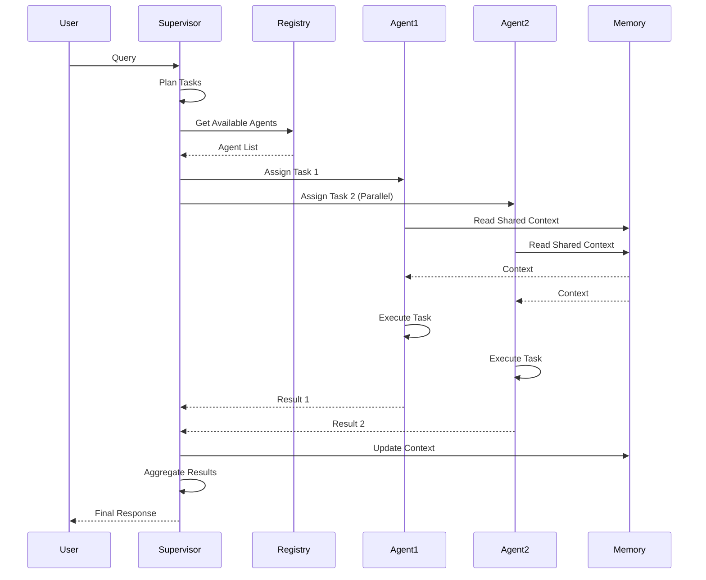
```mermaid
sequenceDiagram
    participant User
    participant Supervisor
    participant Registry
    participant Agent1
    participant Agent2
    participant Memory
    
    User->>Supervisor: Query
    Supervisor->>Supervisor: Plan Tasks
    Supervisor->>Registry: Get Available Agents
    Registry-->>Supervisor: Agent List
    Supervisor->>Agent1: Assign Task 1
    Supervisor->>Agent2: Assign Task 2 (Parallel)
    Agent1->>Memory: Read Shared Context
    Agent2->>Memory: Read Shared Context
    Memory-->>Agent1: Context
    Memory-->>Agent2: Context
    Agent1->>Agent1: Execute Task
    Agent2->>Agent2: Execute Task
    Agent1-->>Supervisor: Result 1
    Agent2-->>Supervisor: Result 2
    Supervisor->>Memory: Update Context
    Supervisor->>Supervisor: Aggregate Results
    Supervisor-->>User: Final Response
```

---

## Deployment Architecture

### Docker Container Architecture

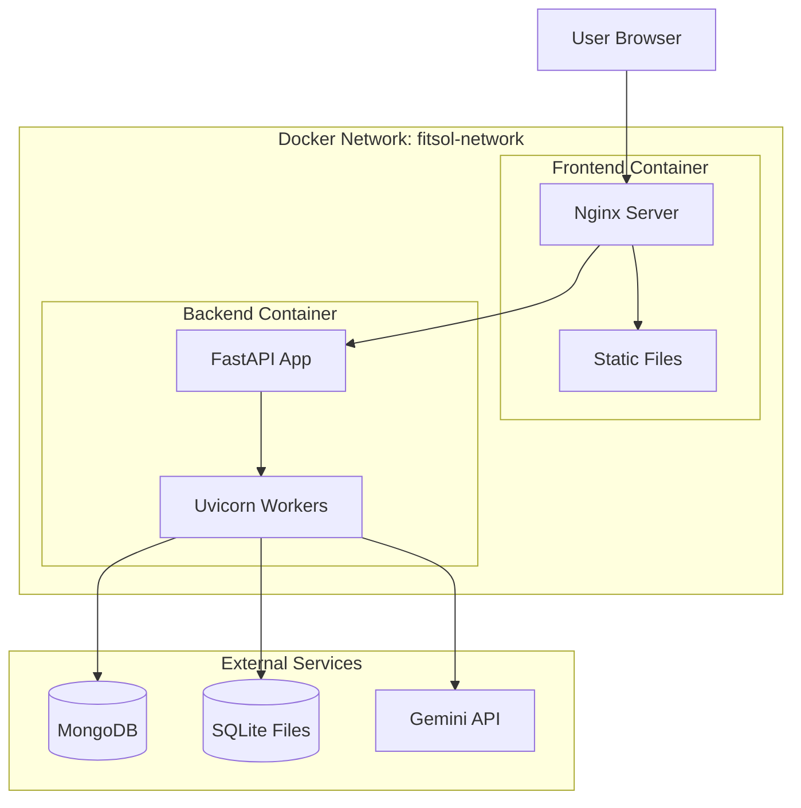
```mermaid
graph TB
    subgraph "Docker Network: fitsol-network"
        subgraph "Frontend Container"
            NGINX[Nginx Server]
            STATIC[Static Files]
        end
        
        subgraph "Backend Container"
            FASTAPI[FastAPI App]
            WORKERS[Uvicorn Workers]
        end
    end
    
    subgraph "External Services"
        MONGO[(MongoDB)]
        SQLITE[(SQLite Files)]
        LLM[Gemini API]
    end
    
    USER[User Browser] --> NGINX
    NGINX --> STATIC
    NGINX --> FASTAPI
    FASTAPI --> WORKERS
    WORKERS --> MONGO
    WORKERS --> SQLITE
    WORKERS --> LLM
```

### Deployment Flow

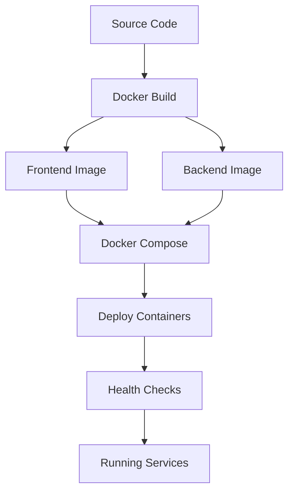
```mermaid
flowchart TD
    CODE[Source Code] --> BUILD[Docker Build]
    BUILD --> IMAGE1[Frontend Image]
    BUILD --> IMAGE2[Backend Image]
    IMAGE1 --> COMPOSE[Docker Compose]
    IMAGE2 --> COMPOSE
    COMPOSE --> DEPLOY[Deploy Containers]
    DEPLOY --> HEALTH[Health Checks]
    HEALTH --> RUNNING[Running Services]
```

---

## Security Architecture

### Authentication & Authorization Flow

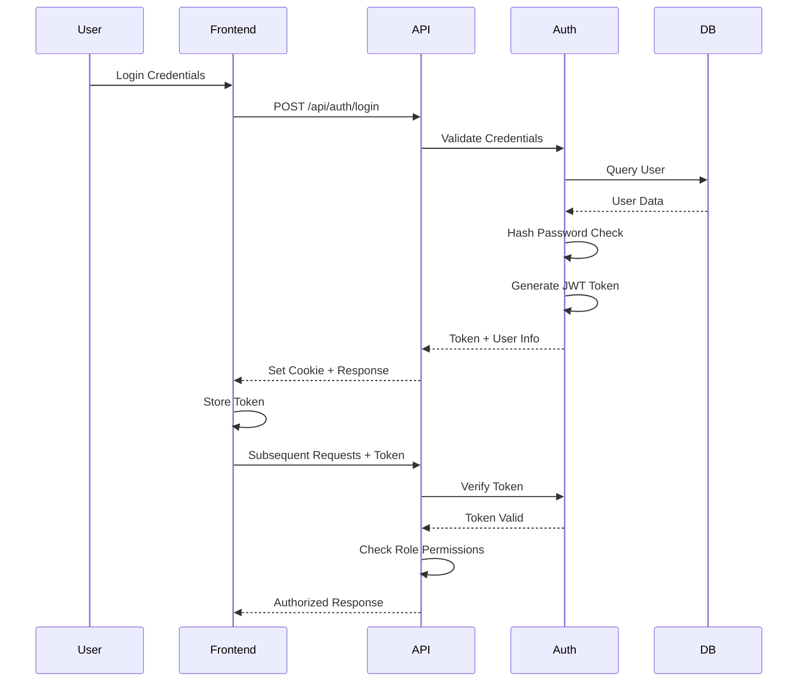
```mermaid
sequenceDiagram
    participant User
    participant Frontend
    participant API
    participant Auth
    participant DB
    
    User->>Frontend: Login Credentials
    Frontend->>API: POST /api/auth/login
    API->>Auth: Validate Credentials
    Auth->>DB: Query User
    DB-->>Auth: User Data
    Auth->>Auth: Hash Password Check
    Auth->>Auth: Generate JWT Token
    Auth-->>API: Token + User Info
    API-->>Frontend: Set Cookie + Response
    Frontend->>Frontend: Store Token
    Frontend->>API: Subsequent Requests + Token
    API->>Auth: Verify Token
    Auth-->>API: Token Valid
    API->>API: Check Role Permissions
    API-->>Frontend: Authorized Response
```

### Security Layers

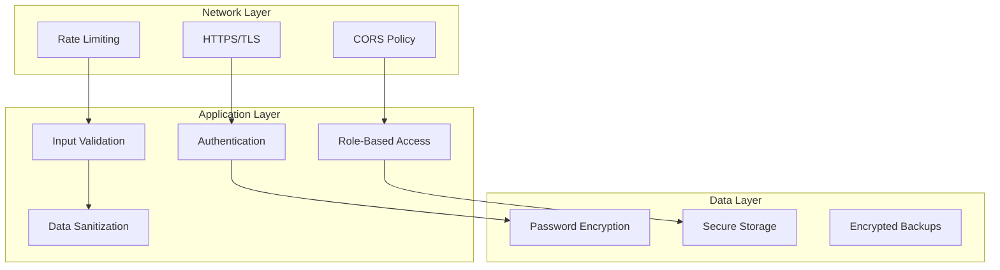
```mermaid
graph TB
    subgraph "Network Layer"
        HTTPS[HTTPS/TLS]
        CORS[CORS Policy]
        RATELIMIT[Rate Limiting]
    end
    
    subgraph "Application Layer"
        AUTH[Authentication]
        RBAC[Role-Based Access]
        VALIDATION[Input Validation]
        SANITIZE[Data Sanitization]
    end
    
    subgraph "Data Layer"
        ENCRYPT[Password Encryption]
        SECURE[Secure Storage]
        BACKUP[Encrypted Backups]
    end
    
    HTTPS --> AUTH
    CORS --> RBAC
    RATELIMIT --> VALIDATION
    AUTH --> ENCRYPT
    RBAC --> SECURE
    VALIDATION --> SANITIZE
```

---

## Scalability & Performance

### Horizontal Scaling Architecture

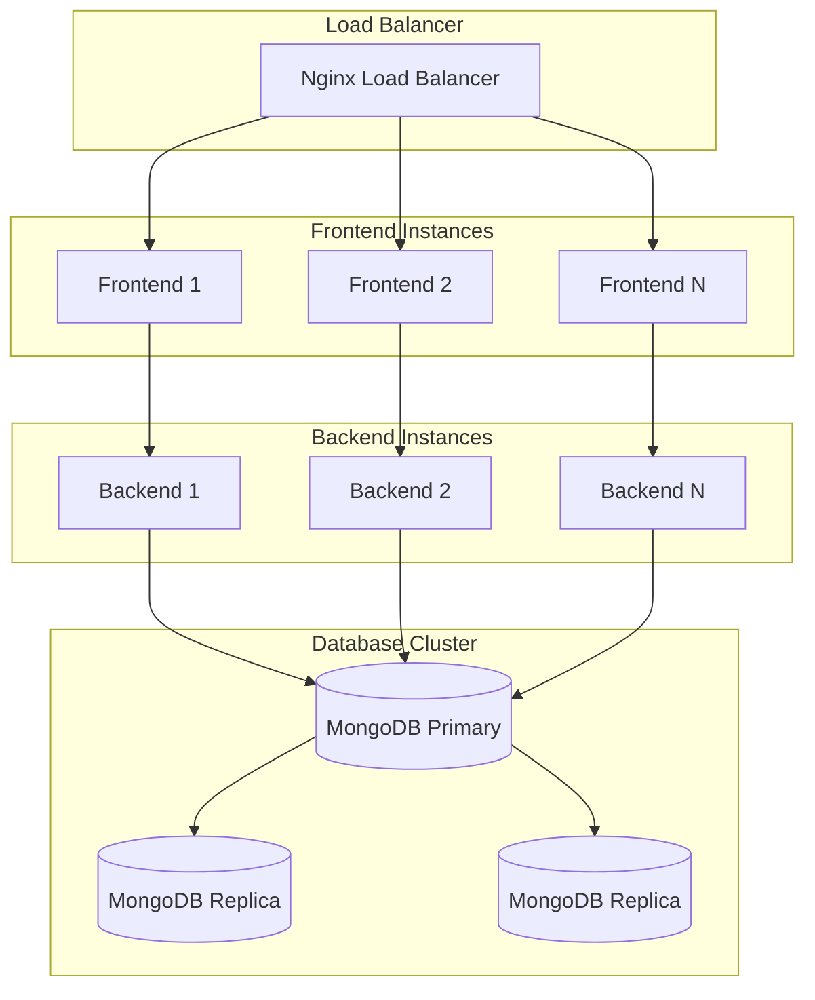
```mermaid
graph TB
    subgraph "Load Balancer"
        LB[Nginx Load Balancer]
    end
    
    subgraph "Frontend Instances"
        FE1[Frontend 1]
        FE2[Frontend 2]
        FE3[Frontend N]
    end
    
    subgraph "Backend Instances"
        BE1[Backend 1]
        BE2[Backend 2]
        BE3[Backend N]
    end
    
    subgraph "Database Cluster"
        MONGO1[(MongoDB Primary)]
        MONGO2[(MongoDB Replica)]
        MONGO3[(MongoDB Replica)]
    end
    
    LB --> FE1
    LB --> FE2
    LB --> FE3
    FE1 --> BE1
    FE2 --> BE2
    FE3 --> BE3
    BE1 --> MONGO1
    BE2 --> MONGO1
    BE3 --> MONGO1
    MONGO1 --> MONGO2
    MONGO1 --> MONGO3
```

### Performance Optimization Strategies

```mermaid
graph LR
    subgraph "Caching"
        REDIS[Redis Cache]
        MEMCACHE[In-Memory Cache]
    end
    
    subgraph "Async Processing"
        QUEUE[Task Queue]
        WORKER[Background Workers]
    end
    
    subgraph "Database"
        INDEX[Database Indexes]
        CONNPOOL[Connection Pooling]
    end
    
    subgraph "API"
        PAGINATION[Pagination]
        COMPRESSION[Response Compression]
    end
    
    REDIS --> QUEUE
    MEMCACHE --> WORKER
    INDEX --> CONNPOOL
    PAGINATION --> COMPRESSION
```

---

## System Integration Points

### External API Integration

```mermaid
graph TB
    APP[Application]
    
    subgraph "LLM Services"
        GEMINI[Google Gemini API]
    end
    
    subgraph "Data Sources"
        EPA[EPA API - Future]
        CLIENT[Client Databases - Future]
    end
    
    subgraph "Monitoring"
        LANGSMITH[LangSmith - Optional]
    end
    
    APP --> GEMINI
    APP -.-> EPA
    APP -.-> CLIENT
    APP -.-> LANGSMITH
```

---

## File Processing Pipeline

```mermaid
flowchart TD
    UPLOAD[File Upload] --> VALIDATE[Validate File Type]
    VALIDATE --> EXTRACT[Extract Content]
    EXTRACT --> PARSE[Parse Data]
    PARSE --> CLEAN[Clean & Normalize]
    CLEAN --> STORE[Store in Database]
    STORE --> EMBED{Should Embed?}
    EMBED -->|Yes| VECTORIZE[Vectorize Content]
    EMBED -->|No| SKIP[Skip Embedding]
    VECTORIZE --> INDEX[Index Vectors]
    INDEX --> READY[Ready for RAG]
    SKIP --> READY
```

---

## Error Handling Architecture

```mermaid
graph TB
    REQUEST[API Request] --> TRY[Try Block]
    TRY --> SUCCESS{Success?}
    SUCCESS -->|Yes| RESPONSE[Return Response]
    SUCCESS -->|No| CATCH[Catch Exception]
    CATCH --> LOG[Log Error]
    LOG --> CLASSIFY[Classify Error Type]
    CLASSIFY --> RECOVER{Recoverable?}
    RECOVER -->|Yes| RETRY[Retry Logic]
    RECOVER -->|No| ERROR[Error Response]
    RETRY --> TRY
    ERROR --> USER[User-Friendly Message]
```

---

## Configuration Management

### Environment Variables

The system uses environment variables for configuration. Create a `.env` file in the project root:

```bash
# MongoDB Configuration
MONGODB_CONNECTION_STRING=mongodb://localhost:27017/fitsol_esg
MONGODB_DB_NAME=fitsol_esg

# LLM Configuration
GEMINI_API_KEY=your_gemini_api_key_here
LLM_PROVIDER=gemini  # Options: gemini, openai, anthropic
LLM_MODEL=gemini-2.0-flash-001
LLM_TEMPERATURE=0.3

# JWT Authentication
JWT_SECRET_KEY=your-secret-key-change-in-production
JWT_ALGORITHM=HS256
JWT_ACCESS_TOKEN_EXPIRE_HOURS=24
JWT_REFRESH_TOKEN_EXPIRE_DAYS=7

# Feature Flags
ENABLE_SUPERVISOR_AGENT=true
ENABLE_AGENT_COMMUNICATION=true
ENABLE_AGENT_MEMORY=true
ENABLE_VISUALIZATION=true
USE_UNIFIED_SEMANTIC_ENGINE=false
USE_INTELLIGENT_CLARIFICATION=true

# CORS Configuration
ALLOWED_ORIGINS=http://localhost:5173,http://localhost:3000
ENVIRONMENT=development
```

### Configuration Files

**System Config (`server/config/system_config.py`):**
- Centralized configuration management
- Loads from environment variables
- Provides type-safe configuration access

**Data Sources Config (`server/config/data_sources.yaml`):**
- Defines available data sources
- Configures data source connections
- Maps data source types to handlers

## Deployment

### Local Development Setup

1. **Clone the repository:**
```bash
git clone <repository-url>
cd fitsol_ant
```

2. **Backend Setup:**
```bash
cd server
python -m venv venv
source venv/bin/activate  # On Windows: venv\Scripts\activate
pip install -r requirements.txt
```

3. **Frontend Setup:**
```bash
cd client
npm install
```

4. **Environment Configuration:**
```bash
cp env.example .env
# Edit .env with your configuration
```

5. **Start Services:**
```bash
# Terminal 1: Backend
cd server
./run_backend.sh  # or: uvicorn main:app --reload

# Terminal 2: Frontend
cd client
npm run dev
```

### Docker Deployment

**Build and Run:**
```bash
cd deployment
docker-compose up -d
```

**Docker Compose Configuration:**
- Frontend: Nginx serving React app on port 80
- Backend: FastAPI on port 8000 (internal)
- Volumes: File storage and data persistence

### Production Deployment

**Requirements:**
- Docker and Docker Compose
- MongoDB instance (local or cloud)
- SSL certificate for HTTPS
- Domain name (optional)

**Steps:**
1. Set production environment variables
2. Configure SSL/TLS certificates
3. Set up MongoDB with authentication
4. Configure firewall rules
5. Set up monitoring and logging
6. Deploy using Docker Compose or Kubernetes

## Monitoring & Logging

### Logging Architecture

**Log Levels:**
- `DEBUG`: Detailed diagnostic information
- `INFO`: General informational messages
- `WARNING`: Warning messages for potential issues
- `ERROR`: Error messages for failures
- `CRITICAL`: Critical errors requiring immediate attention

**Log Locations:**
- Application logs: `logs/app.log`
- Agent logs: `logs/{agent_name}.log`
- Error logs: `logs/errors.log`

### Health Checks

**Health Check Endpoint:**
- `GET /health` - Basic health check
- `GET /health/detailed` - Detailed system status

**Health Check Response:**
```json
{
  "status": "healthy",
  "timestamp": "2024-01-01T00:00:00Z",
  "services": {
    "database": "connected",
    "llm": "available",
    "agents": "ready"
  }
}
```

## Testing

### Test Structure

```
tests/
├── unit/           # Unit tests
├── integration/    # Integration tests
└── ml/             # ML/Agent tests
```

### Running Tests

```bash
# All tests
pytest

# Unit tests only
pytest tests/unit/

# Integration tests
pytest tests/integration/

# Agent tests
pytest tests/ml/agents/
```

### Test Coverage

Target coverage: 80%+
```bash
pytest --cov=server --cov-report=html
```

## Performance Tuning

### Backend Optimization

1. **Database Indexing:**
   - Index frequently queried fields
   - Use compound indexes for multi-field queries
   - Monitor query performance

2. **Caching Strategy:**
   - Cache LLM responses for similar queries
   - Cache emission factors and benchmarks
   - Use Redis for distributed caching (future)

3. **Async Processing:**
   - Use async/await for I/O operations
   - Parallel task execution where possible
   - Background workers for heavy processing

### Frontend Optimization

1. **Code Splitting:**
   - Lazy load routes
   - Split vendor bundles
   - Dynamic imports for heavy components

2. **Asset Optimization:**
   - Minify JavaScript and CSS
   - Optimize images
   - Enable gzip compression

3. **Caching:**
   - Browser caching for static assets
   - Service worker for offline support (future)

## Troubleshooting

### Common Issues

**Issue: MongoDB Connection Failed**
- Check connection string format
- Verify MongoDB is running
- Check network connectivity
- Verify authentication credentials

**Issue: LLM API Errors**
- Verify API key is valid
- Check API quota/limits
- Verify network connectivity
- Check model availability

**Issue: Agent Not Responding**
- Check agent logs
- Verify LLM configuration
- Check database connectivity
- Review error logs

**Issue: Frontend Build Fails**
- Clear node_modules and reinstall
- Check Node.js version
- Verify environment variables
- Check for TypeScript errors

## Conclusion

This architecture provides:

1. **Modularity**: Clear separation of concerns with independent components
2. **Scalability**: Horizontal scaling capabilities with load balancing
3. **Maintainability**: Well-structured codebase with clear patterns
4. **Extensibility**: Easy to add new agents and features
5. **Reliability**: Error handling and recovery mechanisms
6. **Security**: Multi-layer security with authentication and authorization
7. **Performance**: Optimized with caching, async processing, and indexing

The system is designed to handle complex ESG queries through intelligent agent coordination while maintaining high performance and reliability.

### Future Enhancements

- **Microservices Architecture**: Split into independent services
- **Message Queue**: Add RabbitMQ/Kafka for async processing
- **Redis Cache**: Distributed caching layer
- **Kubernetes Deployment**: Container orchestration
- **GraphQL API**: Alternative to REST API
- **WebSocket Support**: Real-time updates
- **Mobile App**: React Native application

