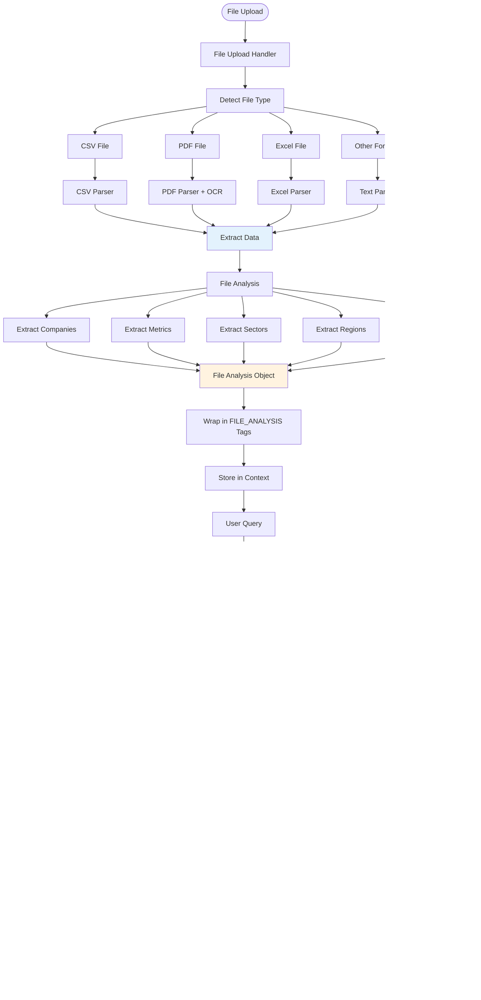

# FitSol ESG Co-Pilot - Technical Documentation

## Table of Contents

1. [System Architecture Overview](#system-architecture-overview)
2. [Agentic Architecture](#agentic-architecture)
3. [Query Processing Flow](#query-processing-flow)
4. [Agent Flows](#agent-flows)
   - [Carbon Accounting Agent](#carbon-accounting-agent)
   - [Benchmarking Agent](#benchmarking-agent)
   - [Net Zero Planner](#net-zero-planner)
5. [Tool Router Architecture](#tool-router-architecture)
6. [File Context Handling](#file-context-handling)
7. [Data Flow Diagrams](#data-flow-diagrams)
8. [Component Interactions](#component-interactions)

---

## System Architecture Overview

### High-Level Architecture

---

## Agentic Architecture

### Complete Agentic System Architecture

---

## Query Processing Flow

### Complete Query Processing Pipeline

---

## Agent Flows

### Carbon Accounting Agent

#### Complete Carbon Accounting Agent Flow

#### Carbon Accounting Agent - Detailed Component Flow

---

### Benchmarking Agent

#### Complete Benchmarking Agent Flow

#### Benchmarking Agent - File-Based Processing Flow

---

### Net Zero Planner

#### Complete Net Zero Planner Flow

#### Net Zero Planner - SBTi Pathway Calculation Flow

---

## Tool Router Architecture

### Tool Router Decision Flow

### Tool Router Decision Logic

---

## File Context Handling

### File Processing and Context Flow

---

## Data Flow Diagrams

### Complete Data Flow Architecture

---

## Component Interactions

### Agent Interaction Sequence

---

## Summary

This technical documentation provides a comprehensive overview of the FitSol ESG Co-Pilot agentic architecture, including:

1. **System Architecture**: High-level view of all components and their interactions
2. **Agentic Architecture**: Complete flow from user query to agent execution
3. **Query Processing Flow**: Detailed sequence of query handling
4. **Agent Flows**: Individual flows for each agent (Carbon, Benchmarking, Net Zero)
5. **Tool Router**: Decision-making logic for routing queries to appropriate agents
6. **File Context Handling**: How uploaded files are processed and integrated
7. **Data Flow**: Complete data flow through the system
8. **Component Interactions**: Sequence diagrams showing component communication

Each agent follows a consistent pattern:
- **Data Extraction**: Using LLM and regex patterns
- **Clarification**: Intelligent clarification orchestrators
- **Calculation**: Dedicated calculation engines
- **Storage**: MongoDB for results
- **Explanation**: LLM-generated natural language responses
- **Visualization**: Automatic chart generation

The system uses a two-layer AI architecture:
- **Layer 1**: Query classification and simple responses
- **Layer 2**: RAG processing with tool routing and agent execution

All agents support file context awareness, allowing them to extract data from uploaded files and enhance their calculations accordingly.

